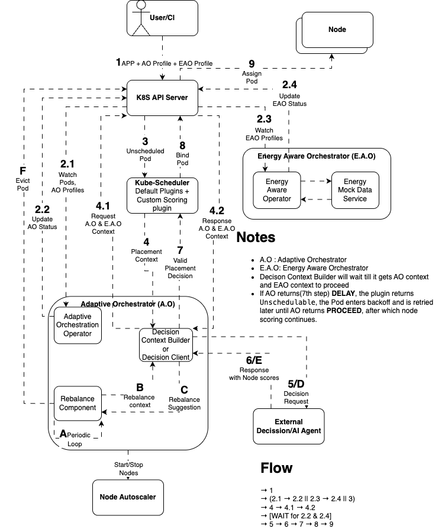

# HIRO Adaptive Orchestrator

A Kubernetes operator that provides intelligent, AI-driven pod placement and adaptive workload orchestration. It introduces the `OrchestrationProfile` custom resource to bind placement strategies to workloads, and integrates with the Kubernetes scheduler to score nodes using an external AI decision agent.

---

## Table of Contents

- [Architecture](#architecture)
  - [Flow 1 -- Reconciliation Controller](#flow-1----reconciliation-controller-status-tracking)
  - [Flow 2 -- Placement Server](#flow-2----placement-server-ai-driven-scheduling)
- [Features](#features)
- [Prerequisites](#prerequisites)
- [Project Initialization](#project-initialization)
- [Getting Started -- Local Development](#getting-started----local-development)
- [Quick Start (automated)](#quick-start-automated)
- [Configuration](#configuration)
  - [Deployment Identity](#deployment-identity)
  - [Environment Variables](#environment-variables-operator-pod)
  - [OrchestrationProfile CRD Reference](#orchestrationprofile-crd-reference)
- [Deployment](#deployment)
  - [Option A -- Kustomize](#option-a----kustomize-recommended-for-development)
  - [Option B -- Helm](#option-b----helm)
  - [Option C -- YAML Bundle](#option-c----yaml-bundle-single-file-install)
- [Mock Decision Agent](#mock-decision-agent)
- [Testing](#testing)
  - [Unit & Integration Tests](#unit--integration-tests)
  - [End-to-End Tests](#end-to-end-tests)
  - [Lint](#lint)
- [Development Workflow](#development-workflow)
- [Project Structure](#project-structure)
- [Upgrading Go Version](#upgrading-go-version)
- [Contributing](#contributing)
- [License](#license)

---

## Architecture



The operator runs as two concurrent services inside a single binary:

| Service | Description |
|---------|-------------|
| **Reconciliation Controller** | Watches `OrchestrationProfile` CRDs and associated workloads (Deployments, StatefulSets, Jobs). Validates specs, discovers pods, and maintains profile status. |
| **Placement Server** (`HTTP :8090`) | Receives `PlacementContext` from a custom kube-scheduler plugin (pod + candidate nodes), enriches it with profile data via O(1) field-indexed cache lookups, delegates scoring to an external AI agent, and returns `NodeScores` to the scheduler. |

### Flow 1 -- Reconciliation Controller (status tracking)

The controller continuously watches workloads and keeps `OrchestrationProfile.status` in sync:

```
Kubernetes API server
        |
        |  OrchestrationProfile created / updated
        |  Deployment / StatefulSet / Job updated
        |  Pod phase changed
        v
Reconciliation Controller
        |
        +-- Validate spec (applicationRef, strategy, awareness)
        |       on failure -> status=Error + Kubernetes Event
        |
        +-- Resolve workload (Deployment / StatefulSet / Job)
        |       not found -> status=Error + Kubernetes Event
        |
        +-- Discover pods via OwnerReference walk
        |       no pods   -> status=NoPods
        |
        +-- Compute pod health (ready / pending / failed counts)
        |       all ready  -> status=Active
        |       some ready -> status=Partial
        |       none ready -> status=Pending
        |       any failed -> status=Degraded
        v
OrchestrationProfile.status updated
        |
        +-- Status transition -> Kubernetes Event emitted
```

### Flow 2 -- Placement Server (AI-driven scheduling)

Called by the kube-scheduler scoring plugin for every pending pod:

```
kube-scheduler plugin
        |
        |  POST /api/v1/placement/decision  { pod, candidateNodes }
        v
PlacementServer (:8090)
        |
        +-- Look up OrchestrationProfile for the pod (O(1) field index)
        |
        +-- Build DecisionRequest
        |   +-- AOProfileContext   (strategy + awareness + current placement)
        |   +-- EAOProfileContext  (energy data, if energy awareness enabled)
        |   +-- CandidateNodes     (full Node objects from scheduler)
        v
External AI / Decision Agent  (DECISION_AGENT_URL)
        |
        |  { nodeScores }
        v
kube-scheduler plugin  ->  selects highest-scored node  ->  schedules pod
```

---

## Features

- **Placement strategies** -- `Balanced`, `Packed`, `Spread`
- **Multi-dimensional resource awareness** -- CPU, Memory, GPU, Energy
- **Energy-aware orchestration** -- optional integration with an `EnergyAwareOrchestration` CRD from an external EAO operator
- **Dynamic rebalancing** -- trigger-based (energy threshold, CPU/memory threshold, node failure, scheduled)
- **AI-delegated scoring** -- pluggable external decision agent via HTTP
- **Status observability** -- rich per-profile status (`NoPods` -> `Pending` -> `Active` -> `Partial` -> `Degraded` -> `Error`)
- **Kubernetes events** -- status transitions and errors recorded as Kubernetes events on the `OrchestrationProfile` resource
- **Production-ready** -- leader election, HTTPS metrics (port 8443), Prometheus/ServiceMonitor support, restricted pod security

---

## Prerequisites

| Tool | Minimum version | Purpose |
|------|----------------|---------|
| Go | 1.25 | Build from source |
| Docker | any recent | Build container image |
| kubectl | v1.29+ | Interact with cluster |
| Kustomize | v5.8+ | Deploy via manifests |
| Helm | v3+ | Deploy via Helm chart |
| Kind | any recent | Local / E2E testing |
| kubebuilder | v4 | Scaffold / code generation |

A running Kubernetes cluster (v1.29+) with a `~/.kube/config` pointing to it is required for deployment.

An **external Decision Agent** reachable at a URL you control is required for the placement server to function. For local testing, a mock agent can be deployed automatically (see [Quick Start](#quick-start-automated)).

---

## Project Initialization

This project was scaffolded using the [Kubebuilder](https://book.kubebuilder.io/) framework. The following commands were used to initialize and scaffold the project:

```bash
# Initialize the project
kubebuilder init \
  --domain orchestration.hiro.io \
  --repo github.com/HIRO-MicroDataCenters-BV/hiro-adaptive-orchestrator \
  --owner "HIRO Adaptive Orchestrator"

# Scaffold the OrchestrationProfile API and controller
kubebuilder create api \
  --group orchestration \
  --version v1alpha1 \
  --kind OrchestrationProfile \
  --resource=true \
  --controller=true

# Add Helm chart generation support
kubebuilder edit --plugins=helm/v2-alpha
```

> These commands are recorded here for reference only. Do **not** re-run them on an existing checkout - they modify project scaffolding files. To regenerate the Helm chart from the current config, use `./hack/deploy_with_make.sh` or see [Option B - Helm](#option-b----helm).

---

## Getting Started -- Local Development

### 1. Clone the repository

```bash
git clone https://github.com/HIRO-MicroDataCenters-BV/hiro-adaptive-orchestrator.git
cd hiro-adaptive-orchestrator
```

### 2. Install dependencies

All Go dependencies are managed via `go.mod`. Build tools (controller-gen, kustomize, envtest, golangci-lint) are downloaded automatically by `make` targets into `./bin/`.

```bash
go mod download
```

### 3. Run code generation

After cloning, or any time you edit `*_types.go` or kubebuilder markers, regenerate the manifests and DeepCopy methods:

```bash
make manifests   # Regenerate CRDs and RBAC from markers
make generate    # Regenerate DeepCopy methods
```

### 4. Install CRDs into your cluster

```bash
make install
```

Verify the CRD was installed:

```bash
kubectl get crd orchestrationprofiles.orchestration.hiro.io
```

### 5. Run the operator locally

Running locally uses your current `kubeconfig` context. Set the required environment variable first:

```bash
export DECISION_AGENT_URL="http://your-decision-agent:8080"
make run
```

The controller starts and the placement server listens on `:8090` by default.

### 6. Apply a sample resource

```bash
kubectl apply -k config/samples/
kubectl get orchestrationprofiles
kubectl get orchestrationprofiles -o yaml
```

---

## Quick Start (automated)

A shell script automates the full deployment cycle: code generation, CRD installation, image build, registry push, Helm chart regeneration, and cluster deployment.

```bash
export GITHUB_PAT_TOKEN=<your-ghcr-token>
export GITHUB_USERNAME=<your-github-username>

./hack/deploy_with_make.sh
```

By default the script deploys a **mock decision agent** in-cluster so no external AI service is needed. To use a real agent:

```bash
export USE_MOCK_AGENT=false
export DECISION_AGENT_URL="http://your-real-agent:8080"
./hack/deploy_with_make.sh
```

To deploy to a **custom namespace** or with a different **resource name prefix**:

```bash
export NAMESPACE=my-custom-namespace
export NAME_PREFIX=my-org-
./hack/deploy_with_make.sh
```

> The script builds and pushes to `ghcr.io/hiro-microdatacenters-bv/hiro-adaptive-orchestrator`. Adjust `DOCKER_REGISTRY` inside the script if you use a different registry.

---

## Configuration

### Deployment Identity

These two variables control the namespace and resource naming for all operator resources. They are applied to `config/default/kustomization.yaml` via `kustomize edit set` before deployment.

| Variable | Default | Description |
|----------|---------|-------------|
| `NAMESPACE` | `hiro-adaptive-orchestrator-system` | Kubernetes namespace for all operator resources |
| `NAME_PREFIX` | `hiro-adaptive-orchestrator-` | Prepended to all resource names (Deployment, ServiceAccount, etc.) by Kustomize |

The ServiceAccount and Deployment names are always derived as `<NAME_PREFIX>controller-manager` (kubebuilder convention base name).

### Environment Variables (operator pod)

| Variable | Required | Default | Description |
|----------|----------|---------|-------------|
| `DECISION_AGENT_URL` | **Yes** | -- | Base URL of the external AI/decision agent (e.g. `http://decision-agent:8080`) |
| `DECISION_AGENT_PATH` | No | `/api/v1/agent/placement/decision` | HTTP path on the AI agent that receives placement requests |
| `PLACEMENT_SERVER_PORT` | No | `:8090` | Listening address for the placement server |
| `PLACEMENT_SERVER_PATH` | No | `/api/v1/placement/decision` | HTTP path the kube-scheduler plugin POSTs to |
| `PLACEMENT_SERVER_HEALTH_PATH` | No | `/healthz` | HTTP path for placement server liveness/readiness probes |
| `EAO_GROUP` | No | `eas.hiro.io` | API group of the `EnergyAwareOrchestration` CRD |
| `EAO_VERSION` | No | `v1` | API version of the `EnergyAwareOrchestration` CRD |
| `EAO_KIND` | No | `EnergyAwareOrchestration` | Kind name of the `EnergyAwareOrchestration` CRD |

All variables have defaults baked into `config/manager/manager.yaml` and are also injectable via `hack/deploy_with_make.sh`.

### OrchestrationProfile CRD Reference

`OrchestrationProfile` is a cluster-scoped resource (short name: `op`).

```yaml
apiVersion: orchestration.hiro.io/v1alpha1
kind: OrchestrationProfile
metadata:
  name: my-app-profile
spec:
  # Reference to the workload this profile governs
  applicationRef:
    apiVersion: apps/v1
    kind: Deployment          # Deployment | StatefulSet | Job
    name: my-app
    namespace: default

  placement:
    strategy: Spread          # Balanced | Packed | Spread
    awareness:
      cpu: false
      memory: false
      gpu: false
      energy: true            # Enables EAOProfileContext enrichment

  rebalancing:
    enabled: true
    cooldownSeconds: 300
    triggerConditions:        # EnergyThreshold | CPUThreshold | MemoryThreshold
      - "EnergyThreshold"     # | NodeFailure | Scheduled
```

#### Placement Strategies

| Strategy | Behaviour |
|----------|-----------|
| `Balanced` | Distributes pods evenly across nodes |
| `Packed` | Concentrates pods on the fewest nodes (bin-packing) |
| `Spread` | Maximises pod spread across failure domains |

#### Profile Status

| Status | Meaning |
|--------|---------|
| `NoPods` | Referenced application has no pods yet |
| `Pending` | Pods exist but none are ready |
| `Active` | All observed pods are ready |
| `Partial` | Some pods are ready; others are pending |
| `Degraded` | One or more pods failed |
| `Error` | Spec validation failed or referenced workload not found |

Status transitions are also recorded as **Kubernetes Events** on the `OrchestrationProfile` resource. Inspect them with:

```bash
kubectl describe orchestrationprofile <name>
```

---

## Deployment

### Option A -- Kustomize (recommended for development)

```bash
# Build image and push to your registry
export IMG=<registry>/<image>:<tag>
make docker-build docker-push IMG=$IMG

# Deploy to the cluster (default namespace and name prefix)
make deploy IMG=$IMG

# Deploy to a custom namespace
NAMESPACE=my-namespace NAME_PREFIX=my-org- make deploy IMG=$IMG

# Verify
kubectl get pods -n hiro-adaptive-orchestrator-system
kubectl logs -n hiro-adaptive-orchestrator-system \
  deployment/hiro-adaptive-orchestrator-controller-manager -c manager -f
```

To tear down:

```bash
make undeploy
make uninstall   # removes CRDs
```

### Option B -- Helm

The Helm chart in `dist/chart/` is **auto-generated** from `config/` on every run of `hack/deploy_with_make.sh`. It picks up all env vars, RBAC rules, and CRD changes automatically. To regenerate it manually:

```bash
rm -rf dist/
kubebuilder edit --plugins=helm/v2-alpha
```

Deploy via Helm:

```bash
export IMG=<registry>/<image>:<tag>

# Deploy to default namespace
make helm-deploy IMG=$IMG

# Deploy to a custom namespace
make helm-deploy IMG=$IMG HELM_NAMESPACE=my-namespace

# Override specific values
make helm-deploy IMG=$IMG HELM_EXTRA_ARGS="--set manager.replicas=2"

# Check status / history
make helm-status
make helm-history

# Rollback / Uninstall
make helm-rollback
make helm-uninstall
```

#### Helm values (key options from `dist/chart/values.yaml`)

| Key | Default | Description |
|-----|---------|-------------|
| `manager.image.repository` | `controller` | Image repository |
| `manager.image.tag` | `latest` | Image tag |
| `manager.replicas` | `1` | Controller replica count |
| `manager.resources.limits.cpu` | `500m` | CPU limit |
| `manager.resources.limits.memory` | `128Mi` | Memory limit |
| `manager.env[].DECISION_AGENT_URL` | `http://decision-agent:8080` | AI agent base URL |
| `manager.env[].DECISION_AGENT_PATH` | `/api/v1/agent/placement/decision` | AI agent HTTP path |
| `manager.env[].PLACEMENT_SERVER_PORT` | `:8090` | Placement server port |
| `manager.env[].PLACEMENT_SERVER_PATH` | `/api/v1/placement/decision` | Placement server path |
| `manager.env[].PLACEMENT_SERVER_HEALTH_PATH` | `/healthz` | Placement server health path |
| `manager.env[].EAO_GROUP` | `eas.hiro.io` | EAO CRD API group |
| `manager.env[].EAO_VERSION` | `v1` | EAO CRD API version |
| `manager.env[].EAO_KIND` | `EnergyAwareOrchestration` | EAO CRD kind |

To override env vars, supply a custom values file:

```yaml
# my-values.yaml
manager:
  env:
    - name: DECISION_AGENT_URL
      value: "http://my-real-agent:8080"
    - name: DECISION_AGENT_PATH
      value: "/api/v1/agent/placement/decision"
    - name: PLACEMENT_SERVER_PORT
      value: ":8090"
    - name: PLACEMENT_SERVER_PATH
      value: "/api/v1/placement/decision"
    - name: PLACEMENT_SERVER_HEALTH_PATH
      value: "/healthz"
    - name: EAO_GROUP
      value: "eas.hiro.io"
    - name: EAO_VERSION
      value: "v1"
    - name: EAO_KIND
      value: "EnergyAwareOrchestration"
```

```bash
helm install hiro-adaptive-orchestrator dist/chart \
  --namespace my-namespace \
  --create-namespace \
  -f my-values.yaml
```

### Option C -- YAML bundle (single file install)

```bash
make build-installer IMG=<registry>/<image>:<tag>
kubectl apply -f dist/install.yaml
```

---

## Mock Decision Agent

For local and CI testing a mock agent is included. It responds to every placement request with all candidate nodes scored equally at 50.

```bash
# Deploy the mock agent manually
kubectl apply -f hack/mock-decision-agent.yaml

# Or use hack/deploy_with_make.sh with the default USE_MOCK_AGENT=true
```

The mock agent is deployed into the operator namespace under the DNS name `decision-agent`, matching the default `DECISION_AGENT_URL=http://decision-agent:8080`.

---

## Testing

### Unit & Integration Tests

Tests use **Ginkgo v2 + Gomega** with `controller-runtime/envtest` (real Kubernetes API server + etcd, no cluster needed):

```bash
make test
```

A coverage profile is written to `cover.out`.

### End-to-End Tests

E2E tests run against an isolated **Kind** cluster (created and torn down automatically):

```bash
make test-e2e
```

> Always run E2E tests against a dedicated Kind cluster -- not your development or production cluster.

### Lint

```bash
make lint        # report issues
make lint-fix    # auto-fix where possible
```

---

## Development Workflow

```
Edit *_types.go or markers
        |
        +-- make manifests   (regenerate CRDs / RBAC)
        +-- make generate    (regenerate DeepCopy)

Edit *.go files
        |
        +-- make lint-fix    (auto-fix style)
        +-- make test        (unit tests)

Ready to deploy
        |
        +-- make docker-build docker-push IMG=...
        +-- make deploy IMG=...  OR  make helm-deploy IMG=...
```

> **Never manually edit** auto-generated files: `config/crd/bases/*.yaml`, `config/rbac/role.yaml`, `zz_generated.*.go`, `dist/chart/`, `dist/install.yaml`.
> Always use `kubebuilder create api` / `kubebuilder create webhook` to scaffold new resources.

---

## Project Structure

```
cmd/main.go                          # Entry point: manager + PlacementServer startup
api/v1alpha1/
  orchestrationprofile_types.go      # CRD schema (OrchestrationProfile)
  zz_generated.deepcopy.go           # Auto-generated -- DO NOT EDIT
internal/
  controller/
    orchestrationprofile_controller.go  # Main reconciler
    op_index.go                         # O(1) field index registration
    op_watchers.go                      # Pod/Workload -> Profile event mapping
    op_validation.go                    # Spec validation
    op_status.go                        # Status computation + event recording
    op_pod_discovery.go                 # Pod resolution (OwnerReference walk)
    op_constants.go                     # Status enum values + event reason constants
  decision/
    server.go                        # HTTP server for kube-scheduler plugin (:8090)
    builder.go                       # Assembles DecisionRequest (incl. EAO profile fetch)
    client.go                        # HTTP client to external AI agent (8s timeout)
    types.go                         # DecisionRequest, DecisionResponse, PlacementContext
  utils/
    helpers.go                       # ResolveAppFromPod, KeysOf, NodeNames
config/
  crd/bases/                         # Generated CRDs -- DO NOT EDIT
  rbac/                              # Generated RBAC -- DO NOT EDIT
  manager/manager.yaml               # Operator Deployment spec (env vars, ports, resources)
  samples/                           # Example OrchestrationProfile + nginx Deployment
  default/                           # Kustomize base (namespace, namePrefix)
dist/
  chart/                             # Generated Helm chart -- regenerated on each deploy
  install.yaml                       # Generated single-file install bundle
test/e2e/                            # End-to-end tests (Kind)
hack/
  deploy_with_make.sh                # Automated full deployment script
  mock-decision-agent.yaml           # In-cluster mock AI agent for testing
```

---

## Upgrading Go Version

When upgrading the Go version for this project, three files must be kept in sync. They are **not** updated automatically by kubebuilder — each requires a manual edit.

| File | Field | Purpose |
|------|-------|---------|
| `go.mod` | `go X.Y.Z` | Minimum Go version required by the project |
| `Makefile` | `GOLANGCI_LINT_VERSION` | golangci-lint version downloaded by `make lint` |
| `.custom-gcl.yml` | `version:` | golangci-lint version used to compile the custom linter binary (must match Makefile) |

### Why they must match

`make lint` builds a **custom** golangci-lint binary that includes the `logcheck` plugin. The custom binary embeds the Go language version from golangci-lint's own `go.mod`. If that embedded version is lower than the `go` directive in `go.mod`, golangci-lint refuses to run:

```
Error: can't load config: the Go language version (go1.24) used to build golangci-lint
is lower than the targeted Go version (1.25.3)
```

Each golangci-lint minor version targets a specific minimum Go version. Pick a golangci-lint release whose `go` directive matches or is >= your project's Go version:

| golangci-lint version | Built with Go |
|-----------------------|---------------|
| v2.8.x | 1.24 |
| v2.9.x and later | 1.25 |

### Step-by-step upgrade

**1. Update the Go version in `go.mod`**

```bash
go mod edit -go=X.Y
go mod tidy
```

**2. Find a compatible golangci-lint version**

```bash
# Check the go directive for a candidate release
curl -s "https://proxy.golang.org/github.com/golangci/golangci-lint/v2/@v/vX.Y.Z.mod" | grep "^go "
```

**3. Update `Makefile`** (kubebuilder-generated, but requires manual version bump)

```makefile
GOLANGCI_LINT_VERSION ?= vX.Y.Z   # line ~203
```

**4. Update `.custom-gcl.yml`** to the same version

```yaml
version: vX.Y.Z   # must match GOLANGCI_LINT_VERSION in Makefile
```

**5. Clear the cached binary and verify**

```bash
rm -f bin/golangci-lint bin/golangci-lint-v<old-version>
make lint
```

### Verify versions at any time

```bash
# Binary version and its embedded Go version
bin/golangci-lint version
go version -m bin/golangci-lint | head -1

# Project and Makefile versions
grep "^go " go.mod
grep "GOLANGCI_LINT_VERSION" Makefile
grep "^version:" .custom-gcl.yml
```

---

## Contributing

1. Fork the repository and create a feature branch.
2. Run `make manifests generate` after editing types.
3. Run `make lint-fix test` before opening a pull request.
4. E2E tests are validated in CI via GitHub Actions against a Kind cluster.

For detailed development guidelines, Kubebuilder CLI cheat sheet, API design conventions, and logging standards, see [AGENTS.md](./AGENTS.md).

---

## License

Licensed under the [Apache License, Version 2.0](https://www.apache.org/licenses/LICENSE-2.0).
