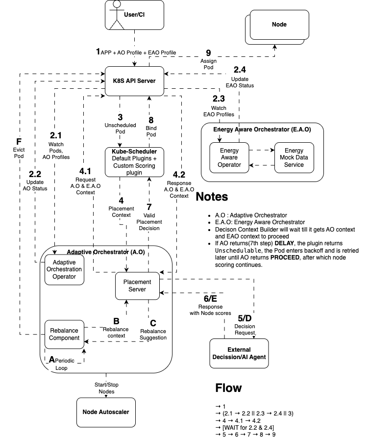

# HIRO Adaptive Orchestrator

A Kubernetes operator that provides intelligent, AI-driven pod placement and adaptive workload orchestration. It introduces the `OrchestrationProfile` custom resource to bind placement strategies to workloads, and integrates with the Kubernetes scheduler to score nodes using an external AI decision agent.

---

## Table of Contents

- [Architecture](#architecture)
  - [Components](#components)
  - [PlacementServer](#placementserver)
  - [Flow 1 — Reconciliation Controller](#flow-1--reconciliation-controller)
  - [Flow 2 — Plugin Path](#flow-2--plugin-path-hiro-scheduler--placementserver)
  - [Flow 3 — Extender Path](#flow-3--extender-path-default-kube-scheduler--placementserver)
  - [Parameter Flow](#parameter-flow)
- [Detailed Scheduling Flows](docs/scheduling-flows.md) ← function-level call chains for both paths
- [Features](#features)
- [Prerequisites](#prerequisites)
- [Quick Start](#quick-start)
- [Deployment](#deployment)
  - [Full-Stack (operator + mock agent + scheduler)](#full-stack-operator--mock-agent--scheduler)
  - [Operator Only](#operator-only)
  - [Mock Decision Agent](#mock-decision-agent-1)
  - [Scheduler Only](#scheduler-only)
  - [Extender Only](#extender-only)
  - [Manual Kustomize](#manual-kustomize)
  - [Helm](#helm)
  - [YAML Bundle](#yaml-bundle)
- [Configuration Reference](#configuration-reference)
  - [All Parameters](#all-parameters)
  - [Operator Environment Variables](#operator-environment-variables)
  - [Scheduler Plugin Config](#scheduler-plugin-config)
  - [OrchestrationProfile CRD](#orchestrationprofile-crd)
- [Scheduler Integration Approaches](#scheduler-integration-approaches)
  - [Plugin Approach (recommended)](#plugin-approach-recommended)
  - [Extender Approach](#extender-approach)
- [Mock Decision Agent](#mock-decision-agent)
- [Testing](#testing)
- [Development Workflow](#development-workflow)
- [Project Structure](#project-structure)
- [Upgrading Go or Kubernetes Version](#upgrading-go-or-kubernetes-version)
- [Contributing](#contributing)
- [License](#license)

---

## Architecture



### Components

The system consists of two independently deployed binaries plus an optional mock AI agent:

| Component | Binary / File | Description |
|-----------|--------------|-------------|
| **Operator** | `cmd/main.go` | Reconciliation controller + PlacementServer HTTP service (`:8090`) serving 4 routes — plugin path, extender filter, extender prioritize, healthz |
| **Scheduler Plugin** | `scheduler-plugin/cmd/main.go` | Custom `kube-scheduler` binary with `HIROScore` plugin registered |
| **Mock Decision Agent** | `hack/mock_decision_agent.yaml` | Lightweight Python HTTP server for local/CI testing; scores all nodes at 50 |

```
┌─────────────────────────────────────────────────────────────────────┐
│  Kubernetes API Server                                              │
└──────────┬──────────────────────────────────────┬───────────────────┘
           │ watch OrchestrationProfiles           │ schedule pods
           │ watch Deployments/StatefulSets/Jobs   │
           ▼                                       │
┌──────────────────────────────────┐    ┌──────────┴──────────────────────┐
│  HIRO Operator Pod               │    │  Scheduler (choose one)         │
│  ────────────────────────────── │    │  ─────────────────────────────  │
│  Reconciler                      │    │  [A] hiro-scheduler (plugin)    │
│                                  │    │      per-pod opt-in             │
│  PlacementServer (:8090)         │◄───┤  [B] default kube-scheduler     │
│  ─────────────────────────────   │    │      extender, cluster-wide     │
│  /api/v1/placement/decision      │    │                                 │
│  /extender/filter                │    │  [A] → /placement/decision      │
│  /extender/prioritize            │    │  [B] → /extender/filter         │
│  /healthz                        │    │       /extender/prioritize      │
└──────────────────┬───────────────┘    └─────────────────────────────────┘
                   │ POST DecisionRequest
                   ▼
         ┌──────────────────────┐
         │  Decision Agent      │
         │  (AI or Mock) :8080  │
         └──────────────────────┘
```

### PlacementServer

The `PlacementServer` is a **single HTTP listener on `:8090`** inside the operator pod. Both scheduler integration approaches — plugin and extender — call the same server on different routes. There is no separate binary or process: it is one `net/http` mux started by `cmd/main.go` alongside the reconciler.

```
            HIRO Operator Pod — PlacementServer (:8090)
           ┌──────────────────────────────────────────────────────────────┐
 hiro-     │  POST /api/v1/placement/decision                            │
 scheduler ►│    1. look up OrchestrationProfile (O(1) field index)       │──► Decision
 (plugin)  │    2. build DecisionRequest (AOProfile + EAOProfile + nodes) │    Agent
           │    3. call External AI Agent → return NodeScores to plugin   │    :8080
           │                                                              │
 default   │  POST /extender/filter                                       │
 scheduler ►│    1. look up OrchestrationProfile for pod                  │
 (extender)│    2. CheckEnergyGate via EAO CRD                            │
           │       allowed  → pass all nodes through unchanged            │
           │       blocked  → FailedNodes: all (scheduler defers the pod) │
           │                                                              │
          ►│  POST /extender/prioritize                                   │──► Decision
           │    1. build DecisionRequest (same pipeline as plugin path)   │    Agent
           │    2. call External AI Agent → map scores [0-100] → [0-10]   │    :8080
           │    3. missing nodes → score 5 (neutral fallback)             │
           │                                                              │
 Kubernetes│  GET  /healthz → 200 ok                                      │
 probes   ►│                                                              │
           └──────────────────────────────────────────────────────────────┘
```

> `/extender/filter` + `/extender/prioritize` share the same `DecisionContextBuilder.Build()` + `DecisionClient.RequestDecision()` pipeline as the plugin path. The filter step runs `CheckEnergyGate` first; the prioritize step calls the AI agent and normalises scores.

### Flow 1 — Reconciliation Controller

```
Kubernetes API server
        │  OrchestrationProfile created / updated
        │  Deployment / StatefulSet / Job updated
        │  Pod phase changed
        ▼
Reconciliation Controller
        ├── Validate spec (applicationRef, strategy, awareness)
        │       on failure → status=Error + Kubernetes Event
        ├── Resolve workload (Deployment / StatefulSet / Job)
        │       not found → status=Error + Kubernetes Event
        ├── Discover pods via OwnerReference walk
        │       no pods   → status=NoPods
        ├── Compute pod health (ready / pending / failed counts)
        │       all ready  → status=Active
        │       some ready → status=Partial
        │       none ready → status=Pending
        │       any failed → status=Degraded
        ▼
OrchestrationProfile.status updated
        └── Status transition → Kubernetes Event emitted
```

### Flow 2 — Plugin Path: hiro-scheduler + PlacementServer

End-to-end flow for pods with `spec.schedulerName: hiro-scheduler`. The `HIROScore` plugin runs inside the `hiro-scheduler` pod; the `PlacementServer` runs inside the operator pod. They communicate via HTTP on `/api/v1/placement/decision`.

```
Pod created with spec.schedulerName: hiro-scheduler
        ▼
hiro-scheduler — Filter phase
        HIROScore.Filter  (soft-fail open — never blocks scheduling)
        ▼
hiro-scheduler — PreScore phase
        HIROScore.PreScore
        │  POST /api/v1/placement/decision
        │  Body: PlacementContext { pod *corev1.Pod, candidateNodes []*corev1.Node }
        ▼
PlacementServer.handlePlacementDecision (:8090, operator pod)
        ├── Decode PlacementContext
        ├── builder.Build() — assemble DecisionRequest
        │     ├── findProfileForPod()      O(1) field index lookup
        │     ├── buildAOProfileContext()  strategy + awareness + current placement
        │     └── fetchEAOProfile()        energy data (only if awareness.Energy=true)
        │
        └── client.RequestDecision()
              │  POST DECISION_AGENT_URL
              │  Body: DecisionRequest { pod, candidateNodes, AOProfile, EAOProfile }
              ▼
        External Decision Agent (:8080)
              │  Response: { nodeScores: [{nodeName, score 0-100}, ...], reason }
              ▼
        PlacementServer → 200 OK { nodeScores, reason }
        ▼
hiro-scheduler — PreScore stashes NodeScores in CycleState
        ▼
hiro-scheduler — Score phase
        HIROScore.Score reads NodeScore from CycleState → returns score to framework
        ▼
hiro-scheduler selects highest-scored node → binds pod
```

Plugin configuration (URL, path, timeout) is injected into the `KubeSchedulerConfiguration` ConfigMap at deploy time — see [Scheduler Plugin Config](#scheduler-plugin-config).

For a detailed function-level trace of every call in this path see [docs/scheduling-flows.md — Path A](docs/scheduling-flows.md#path-a--scheduler-plugin-hiro-scheduler).

### Flow 3 — Extender Path: default kube-scheduler + PlacementServer

End-to-end flow when the extender is deployed. The default `kube-scheduler` calls the PlacementServer during its filter and prioritize phases for **all pods** cluster-wide. No custom scheduler pod is needed.

> **Why ClusterIP, not DNS?** `kube-scheduler` runs with `hostNetwork: true` and uses the node's `/etc/resolv.conf` — not CoreDNS — so `svc.cluster.local` names are unresolvable. kube-proxy iptables/eBPF rules make ClusterIPs reachable from the node network namespace on all cluster types. `deploy_extender.sh` resolves the ClusterIP at deploy time and embeds it in `urlPrefix`.

```
Pod created (any pod — default scheduler handles all)
        ▼
default kube-scheduler
        │  KubeSchedulerConfiguration from /etc/kubernetes/hiro-scheduler-config.yaml
        │  extender urlPrefix: http://<ClusterIP>:8090   ← resolved at deploy time
        │
        ├── Filter phase
        │     POST /extender/filter
        │     Body: ExtenderArgs { Pod *corev1.Pod, Nodes *corev1.NodeList }
        │             ▼
        │     PlacementServer.handleExtenderFilter (operator pod)
        │             ├── CheckEnergyGate(pod)
        │             │     ├── findProfileForPod()   O(1) field index
        │             │     └── fetchEAOProfile()     energy data from EAO CRD
        │             │
        │             ├── allowed  → ExtenderFilterResult { Nodes: all candidates }
        │             └── blocked  → ExtenderFilterResult { FailedNodes: all + reason }
        │                           scheduler defers pod — no node selected this cycle
        │
        └── Score phase (prioritize)
              POST /extender/prioritize
              Body: ExtenderArgs { Pod *corev1.Pod, Nodes *corev1.NodeList }
                      ▼
              PlacementServer.handleExtenderPrioritize (operator pod)
                      ├── builder.Build() — assemble DecisionRequest
                      │     ├── findProfileForPod()
                      │     ├── buildAOProfileContext()
                      │     └── fetchEAOProfile()
                      │
                      ├── client.RequestDecision()
                      │     POST DECISION_AGENT_URL
                      │     Response: { nodeScores: [{nodeName, score 0-100}, ...] }
                      │
                      ├── nodeScoresToHostPriorities()
                      │     score / 10  →  int64 [0-10]  (extender protocol)
                      │     missing node → score 5       (neutral fallback)
                      │
                      └── HostPriorityList [ {host, score 0-10}, ... ]
                              ▼
              kube-scheduler merges extender scores with built-in priorities
              selects highest-scored node → binds pod

On any error (profile not found, AI agent unreachable):
        handleExtenderPrioritize → equalPriorities() → score 5 for all nodes
        scheduling continues using built-in priorities only

If extender is unreachable (ignorable: true in ConfigMap):
        kube-scheduler logs "Skipping extender as it returned error and has ignorable flag set"
        scheduling continues normally — extender never blocks the cluster
```

`ignorable: true` is set in `config/extender/scheduler-config.yaml`. The extender is never a hard dependency for scheduling.

For a detailed function-level trace of every call in this path see [docs/scheduling-flows.md — Path B](docs/scheduling-flows.md#path-b--extender-default-kube-scheduler).

#### Operator logs (extender side)

| Event | Log message |
|-------|-------------|
| Filter request received | `"extender filter request received"` with pod/namespace/nodeCount |
| Energy gate blocked | `"extender filter: energy gate blocked scheduling"` with reason/blockedNodes |
| Prioritize request received | `"extender prioritize request received"` with pod/namespace/nodeCount |
| Prioritize response sent | `"extender prioritize response sent"` with topNode/nodeCount |

### Parameter Flow

```
deploy_full_stack.sh  (master parameter sheet — all vars defined here)
        │  exports every variable
        │
        ├──► Phase 1: check_prerequisites  (always)
        │         command -v kubectl docker
        │         docker info (daemon running)
        │         kubeconfig file exists on disk
        │         kubectl cluster-info --request-timeout=10s (cluster reachable)
        │
        ├──► Phase 2: install_prerequisites  (when DEPLOY_SCHEDULER_PLUGIN=true)
        │         kubectl apply -f cert-manager.yaml (idempotent)
        │         kubectl wait deployment/cert-manager* --for=condition=Available
        │
        ├──► Phase 3: cleanup_conflicting_integration  (always)
        │         DEPLOY_SCHEDULER_PLUGIN=true → undeploy_extender.sh if extender running
        │         DEPLOY_EXTENDER=true         → delete scheduler resources + disable ENABLE_WEBHOOKS
        │                                        if scheduler plugin running
        │
        ├──► Phase 4: deploy_operator.sh
        │         │
        │         ├─ DEPLOY_SCHEDULER_PLUGIN=false → make deploy     (config/default)
        │         ├─ DEPLOY_SCHEDULER_PLUGIN=true  → make deploy-scheduler (config/default-with-webhook)
        │         │     Deploys: Issuer + Certificate + webhook Service + MutatingWebhookConfiguration
        │         │     ENABLE_WEBHOOKS=false in manager.yaml → operator starts without webhook server
        │         │
        │         ├─ sed placement_service_patch.yaml base name
        │         │       → kustomize applies NAME_PREFIX
        │         │       → Kubernetes Service named PLACEMENT_SERVICE_NAME  ✓
        │         │
        │         └─ kubectl set env deployment/<NAME_PREFIX>controller-manager
        │                 ▼
        │           Operator pod  (cmd/main.go reads os.Getenv)
        │                 ▼
        │           PlacementServer / DecisionClient constructed with those values
        │
        ├──► Phase 5: deploy_mock_agent  (when USE_MOCK_AGENT=true)
        │         kubectl apply -f hack/mock_decision_agent.yaml
        │         sed substitutes namespace before apply
        │         mock-decision-agent Service → http://mock-decision-agent:8080
        │
        ├──► Phase 6: wait_for_placement_server
        │         kubectl rollout status deployment/<NAME_PREFIX>controller-manager
        │
        ├──► Phase 7: deploy_scheduler.sh  (when DEPLOY_SCHEDULER_PLUGIN=true)
        │         kustomize build config/scheduler/ | sed (patches pluginConfig)
        │                 ▼
        │         ConfigMap hiro-scheduler-config  (KubeSchedulerConfiguration)
        │                 ▼
        │         hiro-scheduler pod mounts ConfigMap
        │                 ▼
        │         HIROScore.New() reads pluginConfig.args → NewPlacementClient(url, path, timeout)
        │         ghcr-secret attached to scheduler ServiceAccount → image pull succeeds
        │
        ├──► Phase 8: deploy_scheduler_webhook  (when DEPLOY_SCHEDULER_PLUGIN=true)
        │         kubectl wait certificate <NAME_PREFIX>serving-cert --for=condition=Ready
        │         kubectl set env deployment/... ENABLE_WEBHOOKS=true HIRO_SCHEDULER_NAME=...
        │         kubectl rollout restart + rollout status
        │                 ▼
        │           Operator restarts with webhook server active
        │           MutatingWebhookConfiguration CA bundle already injected by cert-manager ca-injector
        │           Pods governed by OrchestrationProfile → spec.schedulerName auto-set to hiro-scheduler
        │           kubectl patch MWC — namespaceSelector excludes WEBHOOK_EXCLUDE_NAMESPACES
        │
        └──► Phase 9: deploy_extender.sh  (when DEPLOY_EXTENDER=true)
                  resolve_placement_url()
                  │   kubectl get svc → ClusterIP (bypasses hostNetwork DNS limitation)
                  │
                  sed → ConfigMap hiro-scheduler-config in kube-system
                  │     urlPrefix: http://<ClusterIP>:8090
                  │
                  Privileged Job on control-plane node:
                  │   cp ConfigMap content → /etc/kubernetes/hiro-scheduler-config.yaml
                  │   patch_scheduler_static_pod.py:
                  │     adds --config flag (idempotent)
                  │     adds hostPath volume + volumeMount (idempotent)
                  │     updates hiro.io/last-updated annotation  ← always, triggers kubelet restart
                  │
                  kubelet detects manifest change via inotify → restarts kube-scheduler
                  wait pod/kube-scheduler-<node> --for=condition=Ready
```

`PLACEMENT_SERVICE_NAME` is applied at **deploy time** to set the Kubernetes Service name. It is not injected into the operator pod (the operator only listens on a port; routing is handled by Kubernetes). The scheduler and extender scripts use `PLACEMENT_SERVICE_NAME` to construct the URL they call.

Each sub-script also works **standalone** — it carries its own `:-` defaults for every variable. When called from `deploy_full_stack.sh`, the parent exports override the defaults.

---

## Features

- **Placement strategies** — `Balanced`, `Packed`, `Spread`
- **Multi-dimensional resource awareness** — CPU, Memory, GPU, Energy
- **Energy-aware orchestration** — optional integration with an `EnergyAwareOrchestration` CRD
- **Dynamic rebalancing** — trigger-based (energy threshold, CPU/memory threshold, node failure, scheduled)
- **AI-delegated scoring** — pluggable external decision agent via HTTP
- **Custom scheduler plugin** — `HIROScore` runs as a separate `hiro-scheduler` binary; pods opt in via `schedulerName: hiro-scheduler`
- **Pod scheduler webhook** — `MutatingAdmissionWebhook` auto-sets `spec.schedulerName: hiro-scheduler` on pods governed by an `OrchestrationProfile`; TLS provisioned automatically by cert-manager; enabled with `DEPLOY_SCHEDULER_PLUGIN=true`
- **Scheduler extender support** — for managed clusters where a custom scheduler pod cannot be deployed; uses ClusterIP for reliable reachability from `hostNetwork` kube-scheduler
- **Status observability** — `NoPods` → `Pending` → `Active` → `Partial` → `Degraded` → `Error`
- **Kubernetes events** — status transitions and errors recorded as events on `OrchestrationProfile`
- **Production-ready** — leader election, HTTPS metrics (:8443), Prometheus/ServiceMonitor support, restricted pod security

---

## Prerequisites

| Tool | Minimum version | Purpose |
|------|----------------|---------|
| Go | 1.25 | Build operator from source |
| Docker | any recent | Build container images |
| kubectl | v1.29+ | Interact with cluster |
| Kustomize | v5.8+ | Deploy via manifests |
| Helm | v3+ | Deploy via Helm chart |
| Kind | any recent | Local / E2E testing |
| kubebuilder | v4 | Scaffold / code generation |
| cert-manager | v1.17+ | TLS for the pod scheduler webhook (required when `DEPLOY_SCHEDULER_PLUGIN=true`) |

A running Kubernetes cluster (v1.29+) with `~/.kube/config` pointing to it is required for deployment.

> **cert-manager** is only required when deploying the scheduler plugin with the mutating webhook (`DEPLOY_SCHEDULER_PLUGIN=true`). `deploy_full_stack.sh` installs it automatically in Phase 2. For operator-only or extender-only deployments it is not needed.

An **external Decision Agent** reachable at a URL you control is required for the placement server to function. For local testing, a mock agent is deployed automatically when `USE_MOCK_AGENT=true` (the default).

---

## Quick Start

```bash
export GITHUB_PAT_TOKEN=<your-ghcr-token>

# Operator + mock agent (default — no scheduler integration)
hack/deploy_full_stack.sh

# Operator + mock agent + extender (patches default kube-scheduler)
DEPLOY_EXTENDER=true hack/deploy_full_stack.sh

# Operator + mock agent + custom scheduler plugin + mutating webhook
# Installs cert-manager, deploys webhook overlay, and auto-enables TLS.
# Pods governed by an OrchestrationProfile automatically get schedulerName: hiro-scheduler.
DEPLOY_SCHEDULER_PLUGIN=true hack/deploy_full_stack.sh

# Real AI agent, custom namespace
USE_MOCK_AGENT=false DECISION_AGENT_URL=http://ai.example.com:8080 \
  NAMESPACE=my-ns hack/deploy_full_stack.sh

# Custom namespace + name prefix + extender
NAMESPACE=my-ns NAME_PREFIX=my-org- DEPLOY_EXTENDER=true hack/deploy_full_stack.sh
```

---

## Deployment

All deploy scripts share the same parameter model: every variable has a default and can be overridden via environment. See [All Parameters](#all-parameters) for the full reference.

### Full-Stack (operator + mock agent + scheduler)

```bash
export GITHUB_PAT_TOKEN=<token>
DEPLOY_EXTENDER=true hack/deploy_full_stack.sh [kubeconfig-path]
```

Runs these phases in order:

| Phase | What runs | Condition |
|-------|-----------|-----------|
| 1 | `check_prerequisites` — verify required binaries, Docker daemon, kubeconfig, and cluster reachability | Always |
| 2 | `install_prerequisites` — install cert-manager and wait for it to be ready | `DEPLOY_SCHEDULER_PLUGIN=true` |
| 3 | `cleanup_conflicting_integration` — auto-remove the opposing scheduler integration if one is running (plugin ↔ extender) | Always |
| 4 | `deploy_operator.sh` — build, push, and deploy the operator (base or webhook overlay) | Always |
| 5 | `deploy_mock_agent` — deploy `hack/mock_decision_agent.yaml` into the operator namespace | `USE_MOCK_AGENT=true` (default) |
| 6 | `wait_for_placement_server` — wait for operator deployment rollout to complete | Always |
| 7 | `deploy_scheduler.sh` — build, push, and deploy the HIRO scheduler pod | `DEPLOY_SCHEDULER_PLUGIN=true` |
| 8 | `deploy_scheduler_webhook` — wait for cert-manager to issue the TLS cert, then set `ENABLE_WEBHOOKS=true` and restart the operator | `DEPLOY_SCHEDULER_PLUGIN=true` |
| 9 | `deploy_extender.sh` — resolve ClusterIP, apply ConfigMap, patch kube-scheduler | `DEPLOY_EXTENDER=true` |

> **Phase 1 — Pre-flight checks:** Runs before any cluster interaction. Verifies `kubectl` and `docker` are in PATH, Docker daemon is running, the kubeconfig file exists, and the cluster is reachable. Fails fast with a clear error so nothing is deployed into a broken environment.

> **Phase 3 — Mutual exclusivity:** Only one scheduler integration (plugin or extender) should be active at a time. If you switch from extender to plugin (or vice versa), Phase 3 automatically tears down the running integration before deploying the new one — no manual cleanup needed.

> **Phase 8 two-phase webhook design:** The operator starts with `ENABLE_WEBHOOKS=false` (set in `config/manager/manager.yaml`). cert-manager issues the TLS certificate after Phase 4 applies the `Certificate` resource. Phase 8 waits for the cert `Secret` to exist before flipping `ENABLE_WEBHOOKS=true` — if the webhook server starts before the cert is ready the operator crashes. The cert volume is mounted `optional: true` so the operator pod starts safely in the interim.

### Operator Only

```bash
export GITHUB_PAT_TOKEN=<token>
hack/deploy_operator.sh [kubeconfig-path]
```

Steps performed:
1. Lint, generate code, install CRDs, build binary
2. Build and push operator Docker image to GHCR
3. Configure Kustomize (namespace + namePrefix)
4. Patch `placement_service_patch.yaml` with the derived base name so kustomize produces `PLACEMENT_SERVICE_NAME` as the Service name
5. Deploy operator — `make deploy` (base, no webhook) or `make deploy-scheduler` (with webhook + cert-manager) based on `DEPLOY_SCHEDULER_PLUGIN`
6. Create GHCR image pull secret
7. Patch ServiceAccount with pull secret
8. Inject environment variables into the operator Deployment
9. Wait for deployment rollout via `kubectl rollout status`
10. Apply sample `OrchestrationProfile` resources

> **Mock agent:** when running `deploy_operator.sh` standalone with `USE_MOCK_AGENT=true`, deploy the mock agent separately:
> ```bash
> kubectl apply -f hack/mock_decision_agent.yaml
> ```
> When using `deploy_full_stack.sh`, the mock agent is deployed automatically in Phase 5.

### Mock Decision Agent

See [Mock Decision Agent](#mock-decision-agent).

### Scheduler Only

The operator must already be running before deploying the scheduler.

```bash
export GITHUB_PAT_TOKEN=<token>
hack/deploy_scheduler.sh [kubeconfig-path]
```

Steps performed:
1. Build scheduler Docker image (build context: repo root; Dockerfile: `scheduler-plugin/Dockerfile`)
2. Push to GHCR — `hiro-scheduler:<SCHED_VERSION>-k8sv<SCHED_K8S_VERSION>`
3. Configure Kustomize for `config/scheduler/` (namespace, namePrefix, image)
4. Patch `KubeSchedulerConfiguration` ConfigMap with placement server URL/path/timeout
5. Apply manifests (ServiceAccount, ClusterRole, ClusterRoleBinding, ConfigMap, Deployment)
6. Create `ghcr-secret` and attach to the scheduler ServiceAccount (required to pull from private GHCR)
7. Rollout restart and wait for scheduler deployment

### Extender Only

For managed Kubernetes clusters (GKE Autopilot, EKS Fargate, etc.) where a custom scheduler pod cannot run. Configures the **default** `kube-scheduler` to call the HIRO PlacementServer during filter and prioritize phases.

```bash
# Operator must already be running
hack/deploy_extender.sh [kubeconfig-path]

# Custom namespace / service name
NAMESPACE=my-ns PLACEMENT_SERVICE_NAME=my-svc hack/deploy_extender.sh

# Air-gapped clusters (supply a local image with python3 + pyyaml)
PATCHER_IMAGE=my-registry/python3-pyyaml:latest hack/deploy_extender.sh

# Roll back — restores original manifest from backup, removes ConfigMaps
hack/undeploy_extender.sh
```

See [Extender Approach](#extender-approach) for the full step-by-step breakdown.

### Manual Kustomize

```bash
export IMG=<registry>/<image>:<tag>
make docker-build docker-push IMG=$IMG

# Base deploy — operator only, no webhook
make deploy IMG=$IMG

# Webhook overlay — operator + MutatingWebhook + cert-manager TLS
# Requires cert-manager to already be installed.
make deploy-scheduler IMG=$IMG

# Tear down
make undeploy && make uninstall
```

### Helm

The Helm chart in `dist/chart/` is auto-generated from `config/`. To regenerate:

```bash
rm -rf dist/
kubebuilder edit --plugins=helm/v2-alpha
```

Deploy:

```bash
make helm-deploy IMG=$IMG
make helm-deploy IMG=$IMG HELM_NAMESPACE=my-namespace
make helm-deploy IMG=$IMG HELM_EXTRA_ARGS="--set manager.replicas=2"

make helm-status
make helm-rollback
make helm-uninstall
```

### YAML Bundle

```bash
make build-installer IMG=<registry>/<image>:<tag>
kubectl apply -f dist/install.yaml
```

---

## Configuration Reference

### All Parameters

Every parameter can be set as an environment variable before calling any deploy script. `deploy_full_stack.sh` exports all of them; each sub-script carries its own `:-` default for standalone use.

#### Identity (shared by all scripts)

| Variable | Default | Description |
|----------|---------|-------------|
| `GITHUB_PAT_TOKEN` | — | **Required.** GitHub PAT with `write:packages` scope |
| `GITHUB_USERNAME` | `sskrishnav` | ghcr.io login |
| `NAMESPACE` | `hiro-adaptive-orchestrator-system` | Kubernetes namespace for all resources |
| `NAME_PREFIX` | `hiro-adaptive-orchestrator-` | Kustomize namePrefix, prepended to all resource names |

#### PlacementServer (operator exposes it; scheduler and extender call it)

| Variable | Default | Description |
|----------|---------|-------------|
| `PLACEMENT_SERVICE_NAME` | `<NAME_PREFIX>controller-manager-placement-service` | k8s Service name for the PlacementServer |
| `PLACEMENT_SERVER_PORT` | `:8090` | Port the PlacementServer listens on |
| `PLACEMENT_SERVER_PATH` | `/api/v1/placement/decision` | HTTP path for placement decisions |
| `PLACEMENT_SERVER_HEALTH_PATH` | `/healthz` | HTTP path for health probes |
| `PLACEMENT_TIMEOUT_SECS` | `8` | Scheduler plugin → PlacementServer request timeout (seconds) |

#### Operator — Decision Agent

| Variable | Default | Description |
|----------|---------|-------------|
| `USE_MOCK_AGENT` | `true` | Deploy and use the in-cluster mock agent (Phase 5 of `deploy_full_stack.sh`) |
| `DECISION_AGENT_URL` | `http://mock-decision-agent:8080` (mock) | Base URL of the AI agent. **Required when `USE_MOCK_AGENT=false`.** |
| `DECISION_AGENT_PATH` | `/api/v1/agent/placement/decision` | HTTP path on the AI agent |

#### Operator — Extender Paths

| Variable | Default | Description |
|----------|---------|-------------|
| `EXTENDER_FILTER_PATH` | `/extender/filter` | Path for extender filter calls |
| `EXTENDER_PRIORITIZE_PATH` | `/extender/prioritize` | Path for extender prioritize calls |

#### Operator — EnergyAwareOrchestration CRD

| Variable | Default | Description |
|----------|---------|-------------|
| `EAO_GROUP` | `eas.hiro.io` | API group of the `EnergyAwareOrchestration` CRD |
| `EAO_VERSION` | `v1` | API version |
| `EAO_KIND` | `EnergyAwareOrchestration` | Kind name |

#### Scheduler

| Variable | Default | Description |
|----------|---------|-------------|
| `SCHED_K8S_VERSION` | `v1.35.0` | Kubernetes minor version the scheduler binary is compiled against |
| `SCHED_VERSION` | `v0.1.0` | Scheduler release version (used in the Docker image tag) |

#### Scheduler Plugin + Webhook

| Variable | Default | Description |
|----------|---------|-------------|
| `DEPLOY_SCHEDULER_PLUGIN` | `false` | `true` → deploy `hiro-scheduler` pod (Phase 7) + mutating webhook (Phase 8); use `make deploy-scheduler` overlay |
| `HIRO_SCHEDULER_NAME` | `hiro-scheduler` | Scheduler name the webhook injects into `spec.schedulerName`; must match the scheduler Deployment |
| `CERT_MANAGER_VERSION` | `v1.17.2` | cert-manager release installed by Phase 2 when `DEPLOY_SCHEDULER_PLUGIN=true` |
| `WEBHOOK_EXCLUDE_NAMESPACES` | `kube-system,kube-public,kube-node-lease` | Comma-separated namespaces the webhook will **not** intercept. Phase 8 patches the `MutatingWebhookConfiguration` with this list. Always include system namespaces in any custom list. |

#### Deploy Options

| Variable | Default | Description |
|----------|---------|-------------|
| `DEPLOY_EXTENDER` | `false` | Set to `true` to deploy the extender and patch kube-scheduler (Phase 9) |

> `DEPLOY_SCHEDULER_PLUGIN` and `DEPLOY_EXTENDER` are mutually exclusive — only one scheduler integration can be active at a time. Phase 3 automatically removes the running integration if you switch between them.

---

### Operator Environment Variables

The operator pod reads configuration exclusively from environment variables — set in `config/manager/manager.yaml` and overridden at deploy time by `deploy_operator.sh` via `kubectl set env`.

| Variable | Default | Read by |
|----------|---------|---------|
| `DECISION_AGENT_URL` | `http://mock-decision-agent:8080` | `decision.NewDecisionClient` |
| `DECISION_AGENT_PATH` | `/api/v1/agent/placement/decision` | `decision.NewDecisionClient` |
| `PLACEMENT_SERVER_PORT` | `:8090` | `decision.NewPlacementServer` |
| `PLACEMENT_SERVER_PATH` | `/api/v1/placement/decision` | `decision.NewPlacementServer` |
| `PLACEMENT_SERVER_HEALTH_PATH` | `/healthz` | `decision.NewPlacementServer` |
| `EXTENDER_FILTER_PATH` | `/extender/filter` | `decision.NewPlacementServer` |
| `EXTENDER_PRIORITIZE_PATH` | `/extender/prioritize` | `decision.NewPlacementServer` |
| `EAO_GROUP` | `eas.hiro.io` | `decision.NewDecisionContextBuilder` |
| `EAO_VERSION` | `v1` | `decision.NewDecisionContextBuilder` |
| `EAO_KIND` | `EnergyAwareOrchestration` | `decision.NewDecisionContextBuilder` |
| `ENABLE_WEBHOOKS` | `false` | `cmd/main.go` — starts the webhook server when `!= "false"`; set to `true` by Phase 8 after the TLS cert is ready |
| `HIRO_SCHEDULER_NAME` | `hiro-scheduler` | `cmd/main.go` → `SetupPodWebhookWithManager` — the name injected into `spec.schedulerName` |

---

### Scheduler Plugin Config

The `HIROScore` plugin is configured via `pluginConfig` inside the `KubeSchedulerConfiguration` ConfigMap (`config/scheduler/configmap.yaml`). The deploy script patches these values from shell variables before applying.

```yaml
pluginConfig:
  - name: HIROScore
    args:
      placementServerURL:  "http://<PLACEMENT_SERVICE_NAME>.<NAMESPACE>.svc.cluster.local<PLACEMENT_SERVER_PORT>"
      placementServerPath: "/api/v1/placement/decision"   # PLACEMENT_SERVER_PATH
      timeoutSeconds:      8                              # PLACEMENT_TIMEOUT_SECS
```

To update a running scheduler's config without redeployment:

```bash
kubectl edit configmap <NAME_PREFIX>hiro-scheduler-config -n <NAMESPACE>
# Then restart the scheduler:
kubectl rollout restart deployment/<NAME_PREFIX>hiro-scheduler -n <NAMESPACE>
```

---

### OrchestrationProfile CRD

`OrchestrationProfile` is a cluster-scoped resource.

```yaml
apiVersion: orchestration.hiro.io/v1alpha1
kind: OrchestrationProfile
metadata:
  name: my-app-profile
spec:
  applicationRef:
    apiVersion: apps/v1
    kind: Deployment          # Deployment | StatefulSet | Job
    name: my-app
    namespace: default

  placement:
    strategy: Spread          # Balanced | Packed | Spread
    awareness:
      cpu: false
      memory: false
      gpu: false
      energy: true            # Enables EAOProfileContext enrichment

  rebalancing:
    enabled: true
    cooldownSeconds: 300
    triggerConditions:
      - "EnergyThreshold"     # EnergyThreshold | CPUThreshold | MemoryThreshold
                              # | NodeFailure | Scheduled
```

For pods to be handled by the HIRO scheduler plugin, add to the pod template:

```yaml
spec:
  schedulerName: hiro-scheduler
```

**When `DEPLOY_SCHEDULER_PLUGIN=true`, you do not need to set `schedulerName` manually.** The `MutatingAdmissionWebhook` automatically sets `spec.schedulerName: hiro-scheduler` on any pod whose owning workload is referenced by an `OrchestrationProfile`. The webhook runs at pod CREATE time with `failurePolicy: Ignore` — pods are never blocked if the webhook is unavailable.

Pods without `schedulerName` (and not covered by a profile) use the default scheduler. When the extender approach is deployed, the default scheduler calls HIRO automatically for all pods.

#### Placement Strategies

| Strategy | Behaviour |
|----------|-----------|
| `Balanced` | Distributes pods evenly across nodes |
| `Packed` | Concentrates pods on the fewest nodes (bin-packing) |
| `Spread` | Maximises pod spread across failure domains |

#### Profile Status

| Status | Meaning |
|--------|---------|
| `NoPods` | Referenced application has no pods yet |
| `Pending` | Pods exist but none are ready |
| `Active` | All observed pods are ready |
| `Partial` | Some pods are ready; others are pending |
| `Degraded` | One or more pods failed |
| `Error` | Spec validation failed or referenced workload not found |

```bash
kubectl describe orchestrationprofile <name>
```

---

## Scheduler Integration Approaches

### Plugin Approach (recommended)

Deploys `hiro-scheduler` as a standalone scheduler pod. Pods opt in by setting `spec.schedulerName: hiro-scheduler` (manually or automatically via the mutating webhook). The default `kube-scheduler` continues to handle all other pods.

**Pros:** Clean separation, no changes to existing workloads, per-pod opt-in, HA-ready (2 replicas with leader election).

```bash
# Full deploy — installs cert-manager, deploys webhook overlay, enables webhook after TLS cert is ready
DEPLOY_SCHEDULER_PLUGIN=true hack/deploy_full_stack.sh

# Standalone scheduler deploy (operator must already be running)
hack/deploy_scheduler.sh

# Verify
kubectl get pods -n hiro-adaptive-orchestrator-system -l app=hiro-scheduler
kubectl logs -n hiro-adaptive-orchestrator-system deployment/hiro-adaptive-orchestrator-hiro-scheduler

# Manually pin a workload (not needed if webhook is enabled — it does this automatically)
kubectl patch deployment my-app -p '{"spec":{"template":{"spec":{"schedulerName":"hiro-scheduler"}}}}'
```

#### Mutating Webhook (auto-schedulerName injection)

When `DEPLOY_SCHEDULER_PLUGIN=true`, a `MutatingAdmissionWebhook` is deployed alongside the scheduler. It intercepts pod CREATE requests and sets `spec.schedulerName: hiro-scheduler` on any pod whose owning Deployment/StatefulSet/Job is referenced by an `OrchestrationProfile`. Users do not need to touch pod templates.

TLS is provisioned entirely by cert-manager — a self-signed `Issuer` and `Certificate` are created automatically by the `config/default-with-webhook` Kustomize overlay. The operator starts with `ENABLE_WEBHOOKS=false`; Phase 8 of `deploy_full_stack.sh` waits for the cert `Secret` to be issued and then enables the webhook via `kubectl set env ENABLE_WEBHOOKS=true`.

```bash
# Verify webhook is live
kubectl get mutatingwebhookconfiguration hiro-adaptive-orchestrator-mutating-webhook-configuration
kubectl get secret hiro-adaptive-orchestrator-webhook-server-cert -n hiro-adaptive-orchestrator-system

# Check operator has webhook enabled
kubectl get deployment hiro-adaptive-orchestrator-controller-manager \
  -n hiro-adaptive-orchestrator-system \
  -o jsonpath='{.spec.template.spec.containers[0].env[?(@.name=="ENABLE_WEBHOOKS")].value}'
# Expected: true
```

To build the scheduler for a different Kubernetes version:

```bash
make pin-k8s-version SCHED_K8S_VERSION=v1.36.0
make build-scheduler
make docker-build-scheduler SCHED_K8S_VERSION=v1.36.0
```

### Extender Approach

Hooks the **default** `kube-scheduler` to call the operator's PlacementServer as an HTTP extender during its filter and prioritize phases. No custom scheduler pod is needed.

**Trade-offs vs plugin approach:**

| | Plugin | Extender |
|---|---|---|
| Scope | Only pods with `schedulerName: hiro-scheduler` | All pods via default scheduler |
| Opt-in | Per-pod | Cluster-wide |
| Control plane change | No | Yes — patches `kube-scheduler` static pod manifest |
| Score range | 0–100 (framework `MinNodeScore`/`MaxNodeScore`) | 0–10 (extender protocol) |
| Failure mode | Soft-fail open | `ignorable: true` (soft-fail open) |
| Scheduler URL | DNS (`svc.cluster.local`) | ClusterIP (resolved at deploy time) |

#### Why ClusterIP for the extender URL

`kube-scheduler` runs with `hostNetwork: true` — it shares the node's network namespace and resolves DNS via the node's `/etc/resolv.conf`. On most clusters this points to the VPC/host DNS resolver, which has no knowledge of `svc.cluster.local` names. CoreDNS only handles DNS for pods in the pod network.

`deploy_extender.sh` calls `resolve_placement_url()` which gets the placement service ClusterIP via `kubectl get svc` and embeds it directly in the `urlPrefix`. kube-proxy iptables/eBPF rules are installed at the kernel level on every node, so ClusterIPs are reachable from the host network namespace on all cluster types.

#### Endpoints served by the PlacementServer

| Endpoint | Verb | Input | Output | Fail behaviour |
|----------|------|-------|--------|----------------|
| `POST /extender/filter` | Filter phase | `ExtenderArgs{Pod, Nodes}` | `ExtenderFilterResult{Nodes, FailedNodes}` | Error → allow all (best-effort) |
| `POST /extender/prioritize` | Score phase | `ExtenderArgs{Pod, Nodes}` | `HostPriorityList[{host, score 0-10}]` | Error → score 5 for all nodes |

Score mapping: AI agent returns scores in `[0, 100]`. The extender normalises to `[0, 10]` via `score / 10`. Nodes not in the AI response get score `5` (neutral) so the scheduler's own priorities still apply.

#### Deploy

`hack/deploy_extender.sh` is a fully automated end-to-end deploy:

```bash
# As part of full-stack
DEPLOY_EXTENDER=true hack/deploy_full_stack.sh

# Standalone (operator must be running)
hack/deploy_extender.sh [kubeconfig-path]

# Roll back
hack/undeploy_extender.sh
```

Steps performed automatically:

| Step | What happens |
|------|-------------|
| 1 | `resolve_placement_url()` — resolves placement service ClusterIP; falls back to DNS with a warning if unavailable |
| 2 | Renders `hiro-scheduler-config` ConfigMap (`urlPrefix: http://<ClusterIP>:8090`) and applies to `kube-system` |
| 3 | Creates `hiro-patch-script` ConfigMap from `hack/patch_scheduler_static_pod.py` |
| 4 | Runs privileged Job on the control-plane node: copies config to `/etc/kubernetes/hiro-scheduler-config.yaml`; runs patch script |
| 5 | Patch script adds `--config` flag, `hostPath` volume, and `volumeMount` to the scheduler manifest (idempotent); **always** updates `hiro.io/last-updated` annotation |
| 6 | Kubelet detects the annotation change via inotify and restarts kube-scheduler with the new config |
| 7 | Waits for `pod/kube-scheduler-<node>` to be Ready |
| 8 | Verifies `--config` flag is present in the live pod spec |

**Why the annotation is needed:** The `--config` patch is idempotent — on re-runs, `patch.py` sees the flag is already present. Without any manifest diff, kubelet keeps the old container running with its in-memory (stale) config. Updating `hiro.io/last-updated` on every run guarantees kubelet always detects a change and restarts the container to read the updated config file from disk.

**Why `hostPath` (not ConfigMap) for the config volume:** Kubelet rejects static pod manifests that reference ConfigMap volumes with `"static pods may not reference configmaps"`. The deploy Job copies the config file to `/etc/kubernetes/hiro-scheduler-config.yaml` on the node filesystem and the manifest references it via a `hostPath` volume.

**Backup:** The original `kube-scheduler.yaml` is backed up to `/etc/kubernetes/kube-scheduler.yaml.hiro-backup` (outside the manifests directory — placing it inside would cause kubelet to read it as a second static pod spec and conflict with the patched manifest).

#### Observability

```bash
# Operator logs — extender requests received
kubectl logs -l control-plane=controller-manager -n hiro-adaptive-orchestrator-system \
  | grep "extender"

# kube-scheduler logs — includes "Skipping extender" when ignored
kubectl logs kube-scheduler-<node> -n kube-system | grep -i extender

# Verify extender URL in the running scheduler
kubectl get pod kube-scheduler-<node> -n kube-system \
  -o jsonpath='{.spec.containers[0].command}' | tr ',' '\n' | grep config
```

See [config/extender/scheduler-config.yaml](config/extender/scheduler-config.yaml) for the ConfigMap template.

---

## Mock Decision Agent

For local and CI testing a mock agent is included at `hack/mock_decision_agent.yaml`. It responds to every placement request with all candidate nodes scored equally at `50`.

```
POST /api/v1/placement/decision  →  nodeScores: [{nodeName, score: 50.0}, ...]
GET  /healthz                    →  200 ok
```

The mock agent runs as a Python 3 `http.server` in a `python:3.11-slim` container. It is deployed into the same namespace as the operator so the short DNS name `mock-decision-agent` resolves from the operator pod.

```bash
# Deployed automatically in Phase 5 when USE_MOCK_AGENT=true (the default)
DEPLOY_EXTENDER=true hack/deploy_full_stack.sh

# Deploy manually
kubectl apply -f hack/mock_decision_agent.yaml

# Verify
kubectl get pods -n hiro-adaptive-orchestrator-system -l app=mock-decision-agent
kubectl logs -n hiro-adaptive-orchestrator-system -l app=mock-decision-agent

# Remove
kubectl delete -f hack/mock_decision_agent.yaml
```

The mock agent listens at `http://mock-decision-agent:8080` inside the operator namespace, matching the default `DECISION_AGENT_URL`.

To switch to a real AI agent:

```bash
USE_MOCK_AGENT=false DECISION_AGENT_URL=http://ai.example.com:8080 hack/deploy_full_stack.sh
```

---

## Testing

### Unit & Integration Tests

```bash
make test
```

Uses **Ginkgo v2 + Gomega** with `controller-runtime/envtest` (real Kubernetes API server + etcd, no cluster needed). Coverage profile written to `cover.out`.

### End-to-End Tests

```bash
make test-e2e
```

Runs against an isolated **Kind** cluster (created and torn down automatically). Never run against a development or production cluster.

### Lint

```bash
make lint        # report issues
make lint-fix    # auto-fix where possible
```

---

## Development Workflow

```
Edit *_types.go or markers
        ├── make manifests   (regenerate CRDs / RBAC)
        └── make generate    (regenerate DeepCopy)

Edit *.go files
        ├── make lint-fix    (auto-fix style)
        └── make test        (unit + integration tests)

Deploy operator only
        └── hack/deploy_operator.sh
           (if USE_MOCK_AGENT=true, also: kubectl apply -f hack/mock_decision_agent.yaml)

Deploy everything (operator + mock agent + extender)
        └── DEPLOY_EXTENDER=true hack/deploy_full_stack.sh

Deploy everything (operator + mock agent + scheduler plugin)
        └── DEPLOY_SCHEDULER_PLUGIN=true hack/deploy_full_stack.sh
```

> **Never manually edit** auto-generated files: `config/crd/bases/*.yaml`, `config/rbac/role.yaml`, `zz_generated.*.go`, `dist/chart/`, `dist/install.yaml`.

---

## Project Structure

```
cmd/
  main.go                              # Operator entry point: manager + PlacementServer
api/v1alpha1/
  orchestrationprofile_types.go        # CRD schema
  zz_generated.deepcopy.go             # Auto-generated — DO NOT EDIT
pkg/
  placement/
    types.go                           # Shared wire types (PlacementContext, DecisionResponse,
                                       # NodeScore) — importable by both operator and scheduler
internal/
  controller/
    orchestrationprofile_controller.go # Main reconciler
    op_index.go                        # O(1) field index (ProfileByAppRefIndex)
    op_watchers.go                     # Pod/Workload → Profile event mapping
    op_validation.go                   # Spec validation
    op_status.go                       # Status computation + event recording
    op_pod_discovery.go                # Pod resolution (OwnerReference walk)
    op_constants.go                    # Status enum + event reason constants
  decision/
    server.go                          # PlacementServer HTTP service (:8090)
                                       #   POST /api/v1/placement/decision  (plugin path)
                                       #   POST /extender/filter            (extender filter)
                                       #   POST /extender/prioritize        (extender scoring)
    builder.go                         # Assembles DecisionRequest + CheckEnergyGate (incl. EAO profile fetch)
    client.go                          # HTTP client to external AI agent
    types.go                           # Type aliases → pkg/placement (zero churn)
    extender_types.go                  # Kubernetes scheduler extender protocol types
                                       #   ExtenderArgs, ExtenderFilterResult, HostPriorityList,
                                       #   HostPriority, EnergyGateResult
  webhook/v1/
    pod_webhook.go                     # PodCustomDefaulter — sets spec.schedulerName on governed pods
                                       # Soft-fail: profile lookup errors allow pod unchanged
  utils/
    helpers.go                         # ResolveAppFromPod, KeysOf, NodeNames
scheduler-plugin/                      # Separate Go module (own go.mod)
  plugin.go                            # HIROScore: FilterPlugin + PreScorePlugin + ScorePlugin
  client.go                            # PlacementClient (HTTP POST to operator)
  client_test.go                       # httptest-based unit tests
  cmd/
    main.go                            # hiro-scheduler binary entry point
  Dockerfile                           # Build context: repo root
  go.mod                               # k8s.io/kubernetes v1.35.0 + staging replace block
  pin_k8s_version.sh                   # Pin go.mod to a specific K8s minor version
config/
  crd/bases/                           # Generated CRDs — DO NOT EDIT
  rbac/                                # Generated RBAC — DO NOT EDIT
  manager/
    manager.yaml                       # Operator Deployment (env vars, ports, resources)
    placement_service_patch.yaml       # ClusterIP Service for PlacementServer (:8090)
  scheduler/
    kustomization.yaml                 # Kustomize base for scheduler manifests
    serviceaccount.yaml                # Scheduler ServiceAccount
    clusterrole.yaml                   # Scheduler RBAC (nodes, pods, bindings, leases…)
    clusterrolebinding.yaml
    configmap.yaml                     # KubeSchedulerConfiguration + HIROScore pluginConfig
    deployment.yaml                    # hiro-scheduler Deployment (2 replicas, HA)
  extender/
    scheduler-config.yaml              # Extender KubeSchedulerConfiguration template
                                       # (urlPrefix uses DNS; deploy_extender.sh substitutes ClusterIP)
  samples/                             # Example OrchestrationProfile + nginx Deployment
  components/
    metrics/                           # Kustomize Component — metrics Service + manager_metrics_patch.yaml
                                       # Shared by config/default and config/default-with-webhook
  default/                             # Kustomize base — operator only, no webhook
  default-with-webhook/                # Kustomize overlay — operator + MutatingWebhook + cert-manager TLS
                                       # Used by make deploy-scheduler; replacements: block derives all
                                       # Certificate dnsNames and MWC CA annotation from resource names
                                       # (no hardcoded values)
  webhook/
    service.yaml                       # Webhook Service (port 443 → 9443)
    manifests.yaml                     # MutatingWebhookConfiguration (failurePolicy: Ignore, CREATE only)
  certmanager/
    certificate-webhook.yaml           # cert-manager Certificate for webhook TLS
    certificate-metrics.yaml           # cert-manager Certificate for metrics TLS
    issuer.yaml                        # Self-signed Issuer
    kustomizeconfig.yaml               # nameReference: Issuer → Certificate.spec.issuerRef
hack/
  deploy_full_stack.sh                 # Full-stack entry point (phases 1–9) — all parameters defined here
  deploy_operator.sh                   # Operator-only deploy (base or webhook overlay per DEPLOY_SCHEDULER_PLUGIN)
  deploy_scheduler.sh                  # Scheduler-only deploy (build → push → kustomize → pull secret → rollout)
  deploy_extender.sh                   # Extender deploy: resolve ClusterIP → ConfigMap → privileged Job → kubelet restart
  undeploy_extender.sh                 # Roll back: restore original kube-scheduler manifest
  patch_scheduler_static_pod.py        # Patch Job script: adds --config, hostPath volume, and
                                       # hiro.io/last-updated annotation (triggers kubelet restart)
  mock_decision_agent.yaml             # In-cluster mock AI agent (Deployment + Service + ConfigMap)
dist/
  chart/                               # Generated Helm chart — DO NOT EDIT
  install.yaml                         # Generated single-file install bundle
test/e2e/                              # End-to-end tests (Kind)
```

---

## Upgrading Go or Kubernetes Version

### Go Version

Three files must be kept in sync (not updated automatically by kubebuilder):

| File | Field |
|------|-------|
| `go.mod` | `go X.Y.Z` |
| `Makefile` | `GOLANGCI_LINT_VERSION` |
| `.custom-gcl.yml` | `version:` |

```bash
# 1. Update go.mod
go mod edit -go=X.Y && go mod tidy

# 2. Find a compatible golangci-lint version
curl -s "https://proxy.golang.org/github.com/golangci/golangci-lint/v2/@v/vX.Y.Z.mod" | grep "^go "

# 3. Update Makefile: GOLANGCI_LINT_VERSION ?= vX.Y.Z
# 4. Update .custom-gcl.yml: version: vX.Y.Z (must match)

# 5. Verify
rm -f bin/golangci-lint*
make lint
```

### Kubernetes Version (scheduler plugin)

The scheduler binary must be compiled against the same Kubernetes minor version as the target cluster.

```bash
# Update scheduler-plugin/go.mod and rebuild
make pin-k8s-version SCHED_K8S_VERSION=v1.36.0
cd scheduler-plugin && go mod tidy

# Rebuild and push image
make docker-build-scheduler SCHED_K8S_VERSION=v1.36.0

# Redeploy scheduler with the new version
SCHED_K8S_VERSION=v1.36.0 hack/deploy_scheduler.sh
```

The `pin_k8s_version.sh` script uses `go mod edit` to surgically update only the `k8s.io/kubernetes` require entry and the staging module replace directives — no full file rewrite.

---

## Project Initialization

Scaffolded using [Kubebuilder](https://book.kubebuilder.io/):

```bash
kubebuilder init \
  --domain orchestration.hiro.io \
  --repo github.com/HIRO-MicroDataCenters-BV/hiro-adaptive-orchestrator \
  --owner "HIRO Adaptive Orchestrator"

kubebuilder create api \
  --group orchestration --version v1alpha1 --kind OrchestrationProfile \
  --resource=true --controller=true

kubebuilder edit --plugins=helm/v2-alpha
```

> Do **not** re-run these on an existing checkout — they modify project scaffolding.

---

## Contributing

1. Fork the repository and create a feature branch.
2. Run `make manifests generate` after editing types.
3. Run `make lint-fix test` before opening a pull request.
4. E2E tests are validated in CI via GitHub Actions against a Kind cluster.

For detailed development guidelines, Kubebuilder CLI cheat sheet, API design conventions, and logging standards, see [AGENTS.md](./AGENTS.md).

---

## License

Licensed under the [Apache License, Version 2.0](https://www.apache.org/licenses/LICENSE-2.0).
