# Rebalance Engine

The rebalance engine is the runtime loop that acts on the AI's guidance *after* initial
placement. It turns HIRO from scheduling-time intelligence into continuous, event-driven
orchestration: watching already-placed workloads, deciding when they should move, and
carrying that decision out safely.

It lives inside the same operator process as the `OrchestrationProfile` controller and the
`PlacementServer` — see [Wiring into the system](#wiring-into-the-system) below. There is no
separate binary, Deployment, or Service for it.

### At a glance

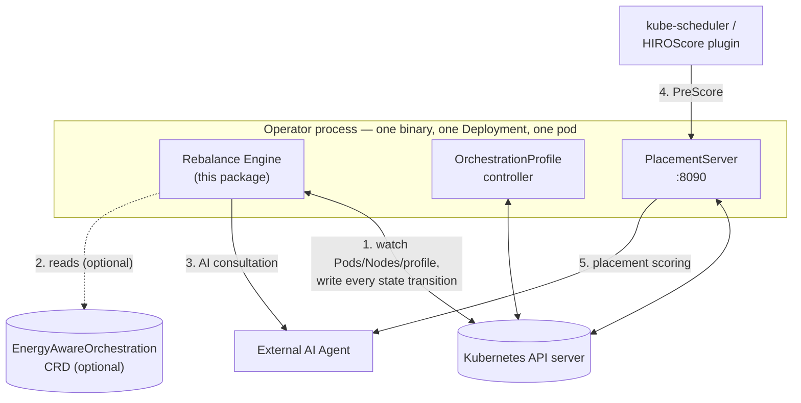
```mermaid
graph TB
    subgraph OP["Operator process — one binary, one Deployment, one pod"]
        RE["Rebalance Engine<br/>(this package)"]
        OC["OrchestrationProfile<br/>controller"]
        PS["PlacementServer<br/>:8090"]
    end
    K8S[("Kubernetes API server")]
    AI["External AI Agent"]
    EAO[("EnergyAwareOrchestration<br/>CRD (optional)")]
    SCHED["kube-scheduler /<br/>HIROScore plugin"]

    RE <-- "1. watch Pods/Nodes/profile,<br/>write every state transition" --> K8S
    OC <--> K8S
    PS <--> K8S
    RE -- "3. AI consultation" --> AI
    PS -- "5. placement scoring" --> AI
    RE -. "2. reads (optional)" .-> EAO
    SCHED -- "4. PreScore" --> PS
```

Numbers above trace one full cycle (the `Move` case touches every numbered edge; `NoOp`/`Retry` stop after step 3):

1. **Rebalance Engine ↔ Kubernetes API** — the engine watches Pods/Nodes/the `OrchestrationProfile` to detect a trigger, then reuses the same connection for every `StateWriter` transition it writes (`Watching → Triggered → …`) and, for an accepted `Move`, the pod eviction call itself.
2. **Rebalance Engine → EnergyAwareOrchestration** *(optional)* — if the profile declares an `EnergyThreshold` trigger, the engine also reads the EAO CRD's current status while evaluating trigger conditions.
3. **Rebalance Engine → External AI Agent** — once `Triggered`, the engine calls the AI during `Evaluating` for a decision (skipped entirely for the mechanical `RetryPendingSchedule` bypass — see [Bypassing the AI for mechanical actions](#bypassing-the-ai-for-mechanical-actions)).
4. **kube-scheduler → PlacementServer** — only reached for an accepted `Move`: evicting the pod in step 1 makes its controller create a replacement, and kube-scheduler calls the PlacementServer's `PreScore` extension point for it, same as any newly-created pod.
5. **PlacementServer → External AI Agent** — the PlacementServer normally re-consults the same AI Agent to score the replacement — unless the `Move`'s `DecisionStore` entry (written in step 1, just before eviction) is still live, in which case that hit short-circuits this call and scores the target node directly instead.

Not numbered because they're continuous background wiring rather than steps in a single cycle: **OC ↔ K8S** is the `OrchestrationProfile` controller's own independent reconcile loop (initial placement — a separate concern from rebalancing), and **PS ↔ K8S** is the PlacementServer reading live pod/node state to build whichever request (scoring or otherwise) it's currently handling.

## Table of Contents

- [The decision lifecycle](#the-decision-lifecycle)
- [Package layout](#package-layout)
- [Detection — how a workload becomes `Triggered`](#detection--how-a-workload-becomes-triggered)
  - [Why both paths exist](#why-both-paths-exist)
  - [The `EnergyAwareOrchestration` watch is optional](#the-energyawareorchestration-watch-is-optional)
- [Trigger conditions](#trigger-conditions)
  - [Bypassing the AI for mechanical actions](#bypassing-the-ai-for-mechanical-actions)
- [Decision — how `Evaluating` calls the AI](#decision--how-evaluating-calls-the-ai)
- [Dispatch — acting on the AI's decision](#dispatch--acting-on-the-ais-decision)
  - [The decision store — how `Move` actually lands a pod on a specific node](#the-decision-store--how-move-actually-lands-a-pod-on-a-specific-node)
  - [Energy-gate-aware timeout classification](#energy-gate-aware-timeout-classification)
  - [Cluster-wide Move rate limit](#cluster-wide-move-rate-limit)
  - [Dry-run mode](#dry-run-mode)
  - [Replica bounds — `AdjustReplicas`](#replica-bounds--adjustreplicas)
  - [AdjustResources — CPU/Memory](#adjustresources--cpumemory)
- [Node pressure (CPU/Memory)](#node-pressure-cpumemory)
- [`StateWriter` — the single-writer rule](#statewriter--the-single-writer-rule)
  - [Why the reader must be uncached](#why-the-reader-must-be-uncached)
  - [Watchdog for a profile stuck in a non-Watching state](#watchdog-for-a-profile-stuck-in-a-non-watching-state)
  - [Escalation — pausing on repeated failures](#escalation--pausing-on-repeated-failures)
- [Wiring into the system](#wiring-into-the-system)
  - [Configuration](#configuration)
  - [RBAC](#rbac)
  - [CRD schema](#crd-schema)
  - [Deployment](#deployment)
- [Demo walkthrough](#demo-walkthrough)
- [Testing](#testing)

<a id="the-decision-lifecycle"></a>
## 🔄 <u>The decision lifecycle</u>

Every rebalance evaluation for a workload is an instance of a state machine, tracked in
`OrchestrationProfile.status.rebalancingStatus`. `state` only ever holds one of five active
values — it never encodes *how* a cycle ended. The result of a finished cycle is recorded
separately, as an `outcome` on the `recentDecisions` entry written in the same transition that
returns `state` to `Watching`.

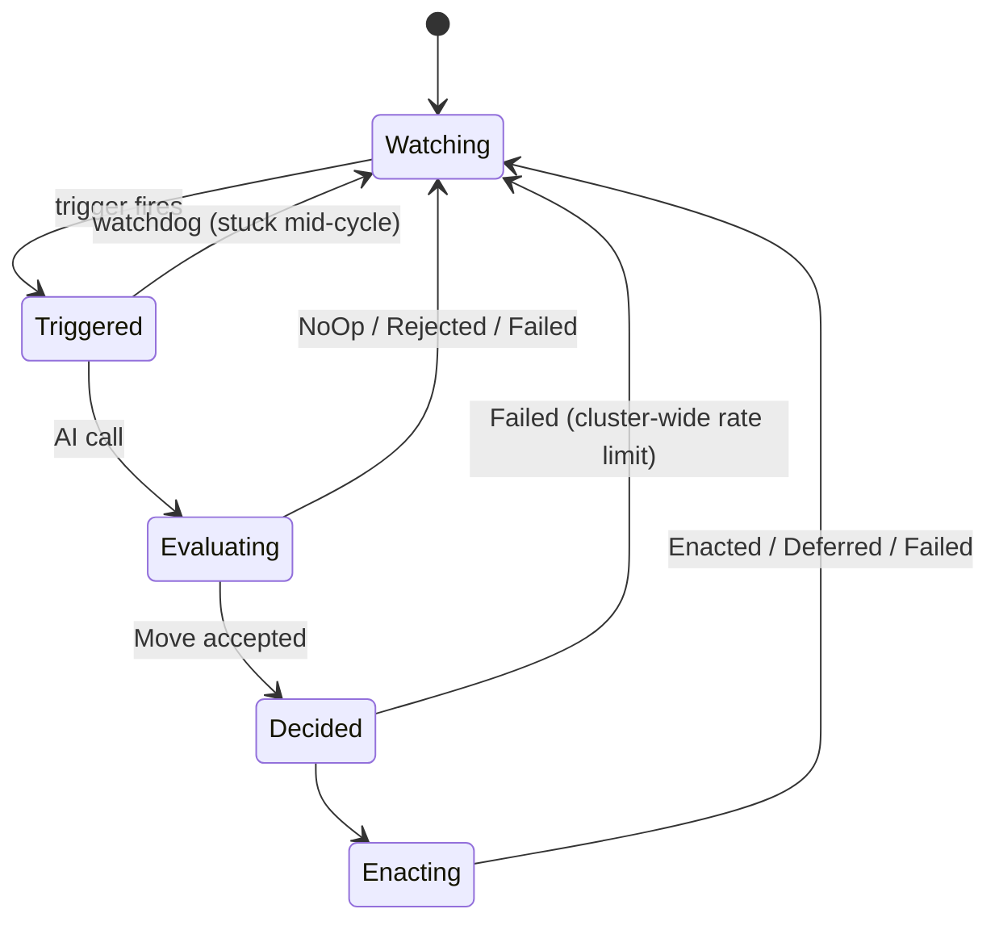
```mermaid
stateDiagram-v2
    [*] --> Watching
    Watching --> Triggered: trigger fires
    Triggered --> Evaluating: AI call
    Triggered --> Watching: watchdog (stuck mid-cycle)
    Evaluating --> Watching: NoOp / Rejected / Failed
    Evaluating --> Decided: Move accepted
    Decided --> Enacting
    Decided --> Watching: Failed (cluster-wide rate limit)
    Enacting --> Watching: Enacted / Deferred / Failed
```

Active states (`state`): `Watching`, `Triggered`, `Evaluating`, `Decided`, `Enacting`.
Outcomes (`recentDecisions[].outcome`, never a `state` value): `Enacted`, `NoOp`, `Rejected`,
`Deferred`, `Failed`, `Escalated` (see
[Escalation — pausing on repeated failures](#escalation--pausing-on-repeated-failures)).

The transition table lives in [`state.go`](state.go) (`validTransitions`,
`IsValidTransition`). From `Watching` (or the unset initial state — the two are equivalent),
the only legal move is into `Triggered` — starting a fresh cycle. Every other edge in the
diagram above is the only path the state machine allows; anything else is rejected by the
writer (see below). `Triggered`, `Evaluating`, `Decided`, and `Enacting` can all transition
straight back to `Watching` — every such write must carry an outcome (`TransitionOptions.Outcome`),
enforced by `StateWriter.Transition` itself. `Decided → Watching` covers dispatchMove's
cluster-wide rate-limit wait (see [below](#cluster-wide-move-rate-limit)): an accepted Move can
fail before ever reaching `Enacting` if the fleet-wide throughput budget isn't available in
time. `Triggered → Watching` exists solely for `recoverStuckCycle` (see
[Watchdog for a profile stuck in a non-Watching state](#watchdog-for-a-profile-stuck-in-a-non-watching-state)) —
nothing in the normal cycle flow ever takes that edge, since a normal `Triggered` cycle always
proceeds to `Evaluating` next.

<a id="package-layout"></a>
## 📁 <u>Package layout</u>

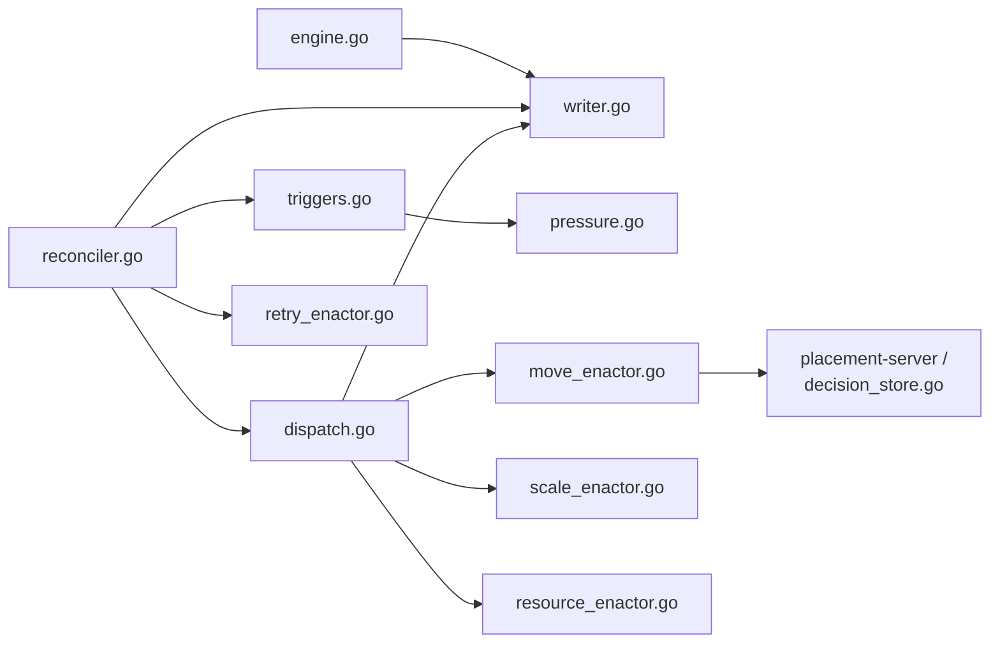
```mermaid
graph LR
    engine[engine.go] --> writer[writer.go]
    reconciler[reconciler.go] --> writer
    reconciler --> triggers[triggers.go]
    triggers --> pressure[pressure.go]
    reconciler --> dispatch[dispatch.go]
    dispatch --> move[move_enactor.go]
    dispatch --> scale[scale_enactor.go]
    dispatch --> resource[resource_enactor.go]
    dispatch --> writer
    reconciler --> retry[retry_enactor.go]
    move --> store["placement-server /<br/>decision_store.go"]
```

| File | Role |
|---|---|
| [`state.go`](state.go) | The transition table. Pure, dependency-free — no I/O. |
| [`writer.go`](writer.go) | `StateWriter` — the **only** component allowed to mutate `status.rebalancingStatus`. |
| [`reconciler.go`](reconciler.go) | `Reconciler` — drives the `Triggered` transition (Detection) and, for trigger matches with no mechanical bypass, the AI consultation (`Evaluating`) too. A real controller-runtime controller. |
| [`triggers.go`](triggers.go) | `TriggerEvaluator` — checks the five CRD-declared trigger conditions. |
| [`pressure.go`](pressure.go) | `NodePressureEvaluator` — CPU/Memory node pressure via metrics-server. Used by `TriggerEvaluator`. |
| [`retry_enactor.go`](retry_enactor.go) | `retryPendingSchedule` — the mechanical enactor for `ActionRetryPendingSchedule` (see [Bypassing the AI for mechanical actions](#bypassing-the-ai-for-mechanical-actions)). |
| [`dispatch.go`](dispatch.go) | `dispatchDecision` and the `actionDispatchers` registry — carries a successful AI response to a terminal transition (see [Dispatch](#dispatch--acting-on-the-ais-decision)). |
| [`move_enactor.go`](move_enactor.go) | `moveEnactor` — evicts a pod and waits for its replacement, driving `Decided → Enacting → Watching` for an accepted `Move`. |
| [`scale_enactor.go`](scale_enactor.go) | `scaleEnactor` — patches `Spec.Replicas` and waits for it to become ready, driving `Decided → Enacting → Watching` for an accepted `AdjustReplicas` (see [Replica bounds](#replica-bounds--adjustreplicas)). |
| [`resource_enactor.go`](resource_enactor.go) | `resourceEnactor` — patches a named container's CPU/Memory and best-effort resizes running pods in place, driving `Decided → Enacting → Watching` for an accepted `AdjustResources` (see [AdjustResources](#adjustresources--cpumemory)). |
| [`engine.go`](engine.go) | `Engine` — a `manager.Runnable` used to register the rebalance engine's lifecycle with the operator's Manager. |

`internal/placement-server/decision_store.go` (not in this package) holds `DecisionStore`,
shared between `moveEnactor` (writes) and `PlacementServer.score` (reads) — see
[The decision store](#the-decision-store--how-move-actually-lands-a-pod-on-a-specific-node).

Every `.go` file above has a matching `_test.go`.

<a id="detection--how-a-workload-becomes-triggered"></a>
## 🔍 <u>Detection — how a workload becomes `Triggered`</u>

Detection is hybrid, per the original design: **event-driven** for fast signals, **periodic**
for slow ones. Both paths call the *exact same* `TriggerEvaluator.Evaluate()` — the watches
and the ticker only decide *when* to check; `Evaluate()` decides *what* currently holds.

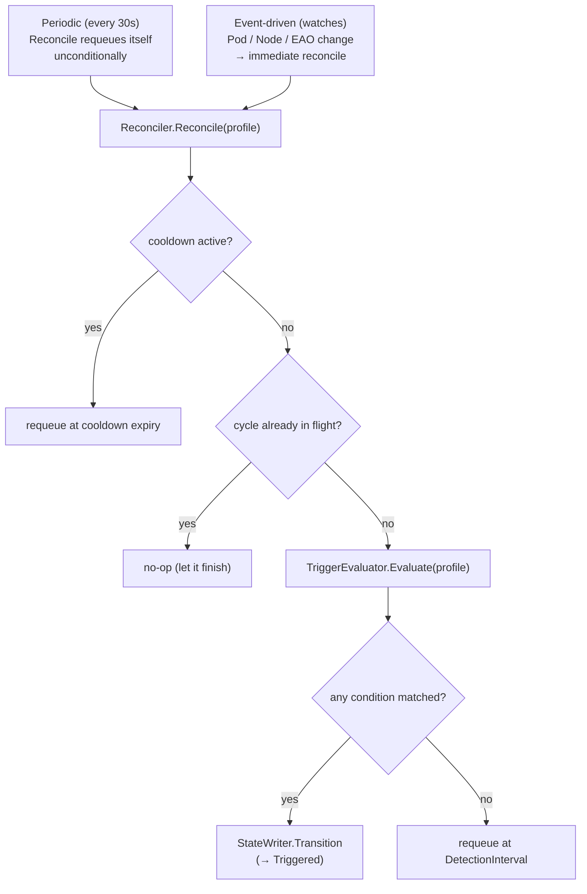
```mermaid
flowchart TD
    P["Periodic (every 30s)<br/>Reconcile requeues itself<br/>unconditionally"] --> RC["Reconciler.Reconcile(profile)"]
    E["Event-driven (watches)<br/>Pod / Node / EAO change<br/>→ immediate reconcile"] --> RC

    RC --> CD{"cooldown active?"}
    CD -->|"yes"| RQ1["requeue at cooldown expiry"]
    CD -->|"no"| IF{"cycle already in flight?"}
    IF -->|"yes"| NOOP["no-op (let it finish)"]
    IF -->|"no"| TE["TriggerEvaluator.Evaluate(profile)"]

    TE --> M{"any condition matched?"}
    M -->|"yes"| SW["StateWriter.Transition<br/>(→ Triggered)"]
    M -->|"no"| RQ2["requeue at DetectionInterval"]
```

### Why both paths exist

- **CPUThreshold, MemoryThreshold, Scheduled** can *only* be caught by the periodic path —
  there's no Kubernetes event for "resource usage drifted past a threshold" or "the
  scheduled window arrived." `Reconcile` requeues itself every `DetectionInterval` (default
  30s) forever, for every rebalancing-enabled profile.
- **EnergyThreshold, NodeFailure** are also checked on the periodic tick, but don't have to
  wait up to 30s — `Reconciler.SetupWithManager` wires watches on `Pod`, `Node`, and (if
  installed) `EnergyAwareOrchestration` that cause an *immediate* reconcile the moment
  something relevant changes.
- **Profile status changes** are covered for free: the primary `For(&OrchestrationProfile{})`
  watch fires on *any* update to the object, including status subresource updates — which is
  also how the Reconciler notices its own `StateWriter` transitions and how later stages of
  the state machine (Decision, Enaction) can drive themselves forward through the same
  `Reconcile` function once they're wired in.

### The `EnergyAwareOrchestration` watch is optional

EAO is a separate, optional CRD (from a different component, the Energy Aware Orchestrator).
`SetupWithManager` checks whether it's actually installed via the manager's `RESTMapper`
before adding a watch for it — if it's absent, the operator logs a note and continues
without that watch rather than failing to start. Without the CRD, `EnergyThreshold` is still
checked, just only on the periodic tick instead of instantly.

<a id="trigger-conditions"></a>
## ⚡ <u>Trigger conditions</u>

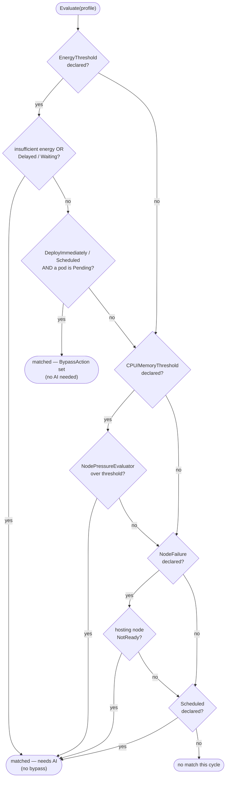
```mermaid
flowchart TD
    Start(["Evaluate(profile)"]) --> C1{"EnergyThreshold<br/>declared?"}
    C1 -- yes --> E1{"insufficient energy OR<br/>Delayed / Waiting?"}
    E1 -- yes --> Match(["matched — needs AI<br/>(no bypass)"])
    E1 -- no --> E2{"DeployImmediately / Scheduled<br/>AND a pod is Pending?"}
    E2 -- yes --> Bypass(["matched — BypassAction set<br/>(no AI needed)"])
    E2 -- no --> C2
    C1 -- no --> C2{"CPU/MemoryThreshold<br/>declared?"}
    C2 -- yes --> P{"NodePressureEvaluator<br/>over threshold?"}
    P -- yes --> Match
    P -- no --> C3
    C2 -- no --> C3{"NodeFailure<br/>declared?"}
    C3 -- yes --> N{"hosting node<br/>NotReady?"}
    N -- yes --> Match
    N -- no --> C4
    C3 -- no --> C4{"Scheduled<br/>declared?"}
    C4 -- yes --> Match
    C4 -- no --> None(["no match this cycle"])
```

`TriggerEvaluator.Evaluate` (in [`triggers.go`](triggers.go)) walks
`profile.Spec.Rebalancing.TriggerConditions` in the order the user declared them and returns
the **first** one that currently matches. If nothing matches, that's not an error — it's just
nothing to do this cycle.

| Condition | How it's checked |
|---|---|
| `EnergyThreshold` | Finds the `EnergyAwareOrchestration` matching the profile's `ApplicationRef` directly (no pod resolution needed, unlike the placement-server's pod-triggered EAO lookup). Three cases, in order: (1) energy reported insufficient, (2) decision is `Delayed`/`Waiting`, (3) decision says `DeployImmediately`/`Scheduled` **and** a pod for this app is still `Pending` — meaning it was likely blocked by the energy gate earlier and the window has since reopened. Case 3 deliberately reads the EAO's *current* status rather than parsing `nextEvaluationTime` itself — by the time this runs, the EAO's own status already reflects the new window. Case 3 also sets `TriggerResult.BypassAction` — see below. |
| `CPUThreshold` / `MemoryThreshold` | Delegates to `NodePressureEvaluator` for every distinct node the profile's pods are currently on. |
| `NodeFailure` | `NotReady` condition on any node hosting one of the profile's pods. |
| `Scheduled` | Always matches — the periodic tick itself *is* the schedule. |

EAO being unavailable, or a metrics-server call failing, is soft-failed per condition
(logged at V(1), evaluator moves on) — never a hard error that would derail the whole
`Evaluate()` call or the reconcile.

### Bypassing the AI for mechanical actions

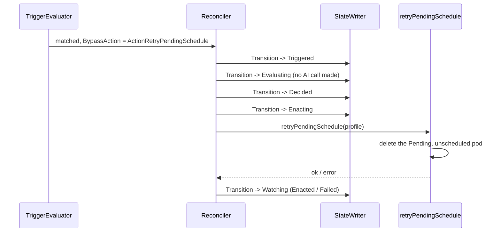
```mermaid
sequenceDiagram
    participant T as TriggerEvaluator
    participant R as Reconciler
    participant W as StateWriter
    participant E as retryPendingSchedule

    T->>R: matched, BypassAction = ActionRetryPendingSchedule
    R->>W: Transition -> Triggered
    R->>W: Transition -> Evaluating (no AI call made)
    R->>W: Transition -> Decided
    R->>W: Transition -> Enacting
    R->>E: retryPendingSchedule(profile)
    E->>E: delete the Pending, unscheduled pod
    E-->>R: ok / error
    R->>W: Transition -> Watching (Enacted / Failed)
```

`EnergyThreshold`'s case 3 (pending pod, window reopened) is different from the other two
cases in one important way: there's no judgment call to make. Cases 1/2 are genuine problem
signals that need the AI to decide *what* to do about them (see
[Decision — how `Evaluating` calls the AI](#decision--how-evaluating-calls-the-ai) below).
Case 3's answer is already fully determined the moment it matches:
delete the pod, let it get scheduled again. Sending that through an AI round-trip would add
a network call and a timeout-failure surface for a question that has no real answer to give.

Why does the pod need any nudge at all, though — won't Kubernetes retry it? Eventually, yes:
`CheckEnergyGate` in `internal/placement-server` re-evaluates the EAO fresh on every
scheduling attempt, and kube-scheduler's own unschedulable-pod pool gets periodically
flushed and retried regardless of any specific event. But kube-scheduler has **no informer
on `EnergyAwareOrchestration`** — it doesn't watch that CRD, so an EAO status update by
itself pushes zero signal into the scheduling queue. The pod schedules only whenever
kube-scheduler's own independent backoff timer happens to roll around, which is decoupled
from the actual fix and could take a while. This mechanism exists purely to close that
latency gap, not to fix a correctness gap.

So instead of an annotation-patch nudge (unreliable — whether a generic pod update actually
causes kube-scheduler to requeue *that* pod depends on internal queueing-hint heuristics we
don't control), `retryPendingSchedule` (in [`retry_enactor.go`](retry_enactor.go)) **deletes**
the Pending, unscheduled pod outright. Its owning controller (Deployment/StatefulSet/Job)
notices the missing replica and creates a fresh Pod object — a `CREATE` event, which
unconditionally goes through full scheduling immediately, no heuristics involved. This is
safe specifically because the pod was never `Ready`: deleting it has no availability/PDB
implications the way evicting a running pod would (unlike the future Move enactor, which
will need the PDB-aware Eviction API for exactly that reason).

`Reconciler.enactBypassAction` (in `reconciler.go`) drives this end to end in a single
`Reconcile` call: `Triggered → Evaluating → Decided → Enacting → Watching` (outcome `Enacted`
or `Failed`), all through `StateWriter` (so it's fully visible in status/Events/
`recentDecisions`) — `Evaluating` just records "no AI needed" instead of making an HTTP call,
and `Enacting` calls `retryPendingSchedule`. No new edges in the transition table: this still
only ever reaches `Watching` via `Decided → Enacting`, same as every other action will.

One deliberate scope pull-forward: this terminal transition sets `cooldownUntil` from
`profile.Spec.Rebalancing.CooldownSeconds` even though general cooldown-duration computation
for the rest of the engine isn't built yet — without it, a delete that doesn't actually fix
the problem would retry every `DetectionInterval` in a tight loop.

<a id="decision--how-evaluating-calls-the-ai"></a>
## 🧠 <u>Decision — how `Evaluating` calls the AI</u>

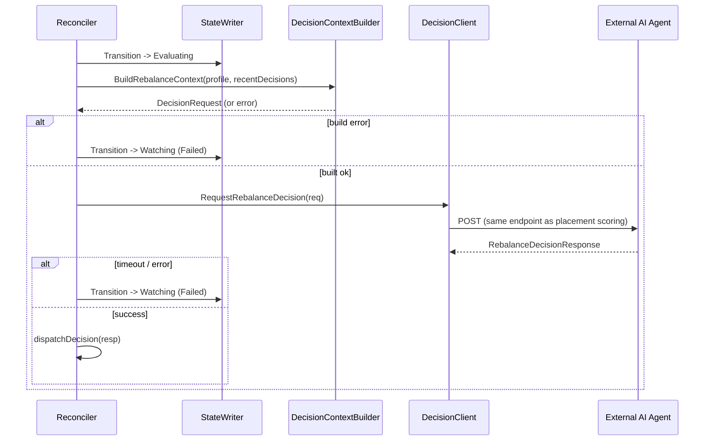
```mermaid
sequenceDiagram
    participant R as Reconciler
    participant W as StateWriter
    participant B as DecisionContextBuilder
    participant C as DecisionClient
    participant AI as External AI Agent

    R->>W: Transition -> Evaluating
    R->>B: BuildRebalanceContext(profile, recentDecisions)
    B-->>R: DecisionRequest (or error)
    alt build error
        R->>W: Transition -> Watching (Failed)
    else built ok
        R->>C: RequestRebalanceDecision(req)
        C->>AI: POST (same endpoint as placement scoring)
        AI-->>C: RebalanceDecisionResponse
        alt timeout / error
            R->>W: Transition -> Watching (Failed)
        else success
            R->>R: dispatchDecision(resp)
        end
    end
```

For every trigger match that has no mechanical bypass (i.e. `TriggerResult.BypassAction` is
empty), `Reconciler.evaluateWithAI` (in `reconciler.go`) drives `Triggered → Evaluating` and
consults the External AI Agent — the same agent the placement server already uses for
initial-placement scoring, not a second HTTP path:

1. `StateWriter.Transition` moves the profile `Triggered → Evaluating`, capturing the fresh
   `decisionId` and the profile's `recentDecisions` history from the write result — no extra
   `Get()` needed, avoiding the cache-staleness bug class described above.
2. `DecisionContextBuilder.BuildRebalanceContext` (in `internal/placement-server`) assembles a
   `DecisionRequest`: every pod of the application and its current node (`CurrentPlacements` —
   the AI needs the whole layout, not just one pod, to judge imbalance and pick both which pod
   to move and where), every `Ready` cluster node as a candidate, the profile's strategy/
   awareness/rebalancing config, optional EAO energy data, the trigger reason, and recent
   decision history.
3. `DecisionClient.RequestRebalanceDecision` POSTs that request under a configurable timeout
   (`Reconciler.DecisionTimeout`, default 5s) and decodes a `RebalanceDecisionResponse`:
   `Action` (`orchestrationv1alpha1.RebalanceAction` — `Move`, `NoOp`, and other values defined
   there for later stories; a named type so Go call sites get compile-time-checked comparisons
   even though the wire format is a plain JSON string), `PodName` (which pod from
   `CurrentPlacements` the action applies to — required for `Move`, since `TargetNode` alone
   can't say which pod is going there when more than one could), `TargetNode`, `Improvement`,
   and `Reason`.
4. A context-build error or a request timeout/error returns the profile to `Watching` with
   outcome `Failed` via `failEvaluation` (with the profile's own cooldown applied, so an
   unreachable AI agent is retried on the normal cooldown cadence instead of every single
   `DetectionInterval` tick), with a reason describing which step failed. A successful response
   is handed to `Reconciler.dispatchDecision` (in `dispatch.go`) — see
   [Dispatch — acting on the AI's decision](#dispatch--acting-on-the-ais-decision) below.

<a id="dispatch--acting-on-the-ais-decision"></a>
## 📨 <u>Dispatch — acting on the AI's decision</u>

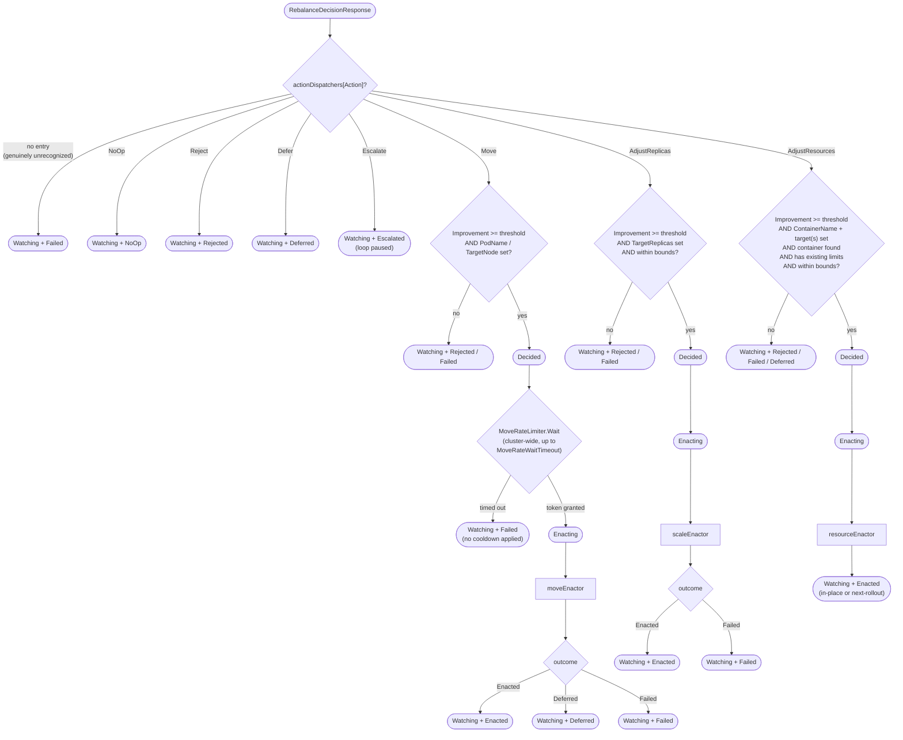
```mermaid
flowchart TD
    Resp(["RebalanceDecisionResponse"]) --> Reg{"actionDispatchers[Action]?"}
    Reg -- "no entry<br/>(genuinely unrecognized)" --> F1(["Watching + Failed"])
    Reg -- NoOp --> N1(["Watching + NoOp"])
    Reg -- Reject --> N2(["Watching + Rejected"])
    Reg -- Defer --> N3(["Watching + Deferred"])
    Reg -- Escalate --> N4(["Watching + Escalated<br/>(loop paused)"])
    Reg -- Move --> G{"Improvement >= threshold<br/>AND PodName / TargetNode set?"}
    G -- no --> Rej(["Watching + Rejected / Failed"])
    G -- yes --> D(["Decided"])
    D --> RL{"MoveRateLimiter.Wait<br/>(cluster-wide, up to<br/>MoveRateWaitTimeout)"}
    RL -- "timed out" --> RLF(["Watching + Failed<br/>(no cooldown applied)"])
    RL -- "token granted" --> Enacting(["Enacting"]) --> ME["moveEnactor"]
    ME --> Out{"outcome"}
    Out -- Enacted --> W1(["Watching + Enacted"])
    Out -- Deferred --> W2(["Watching + Deferred"])
    Out -- Failed --> W3(["Watching + Failed"])

    Reg -- AdjustReplicas --> G2{"Improvement >= threshold<br/>AND TargetReplicas set<br/>AND within bounds?"}
    G2 -- no --> Rej2(["Watching + Rejected / Failed"])
    G2 -- yes --> D2(["Decided"]) --> Enacting2(["Enacting"]) --> SE["scaleEnactor"]
    SE --> Out2{"outcome"}
    Out2 -- Enacted --> W4(["Watching + Enacted"])
    Out2 -- Failed --> W5(["Watching + Failed"])

    Reg -- AdjustResources --> G3{"Improvement >= threshold<br/>AND ContainerName + target(s) set<br/>AND container found<br/>AND has existing limits<br/>AND within bounds?"}
    G3 -- no --> Rej3(["Watching + Rejected / Failed / Deferred"])
    G3 -- yes --> D3(["Decided"]) --> Enacting3(["Enacting"]) --> RE["resourceEnactor"]
    RE --> Out3(["Watching + Enacted<br/>(in-place or next-rollout)"])
```

[`dispatch.go`](dispatch.go) carries a successful `RebalanceDecisionResponse` the rest of the
way to a terminal `Watching` write. It's a registry (`actionDispatchers`, keyed by
`orchestrationv1alpha1.RebalanceAction`), not a hardcoded switch, so a future action is a new map
entry — `dispatchDecision` itself never changes. An action with no registered dispatcher —
genuinely unrecognized, not one of the known values — is treated as a processing error —
`Watching` + outcome `Failed` — rather than guessed at.

- **`NoOp`** (`dispatchNoOp`) exits straight from `Evaluating` to `Watching` with outcome `NoOp`.
  No `Decided`/`Enacting` hop — both are valid direct exits from `Evaluating` in
  `validTransitions`.
- **`Reject`** (`dispatchReject`) and **`Defer`** (`dispatchDefer`) mirror `NoOp` exactly, just
  with outcome `Rejected`/`Deferred` instead of `NoOp` — the AI actively chose not to act (as
  opposed to NoOp's "nothing needs to change"), so recording that as `Failed` via the
  no-dispatcher fallthrough would misreport a deliberate decision as a processing error. `Defer`
  still applies the profile's cooldown, same as every other terminal `Watching` write.
- **`Escalate`** (`dispatchEscalate`) also mirrors `NoOp` — the AI itself decided this workload
  needs a human rather than further automated action. It ends up recorded exactly the same way a
  *repeated-failure* auto-escalation does (see
  [Escalation — pausing on repeated failures](#escalation--pausing-on-repeated-failures)):
  outcome `Escalated`, which also sets the persistent flag that pauses this profile's loop.
- **`Move`** (`dispatchMove`) first applies the improvement-threshold guardrail
  (`Reconciler.ImprovementThreshold`, default `DefaultImprovementThreshold` — a single global
  value for now, not per-trigger-reason). Below threshold, or missing `PodName`/`TargetNode`,
  exits straight to `Watching` (`Rejected` / `Failed`) without ever reaching `Decided`. An
  accepted, well-formed `Move` transitions to `Decided`, then must clear the cluster-wide rate
  limit (see [below](#cluster-wide-move-rate-limit)) before `Enacting` and calling `moveEnactor`
  ([`move_enactor.go`](move_enactor.go)):
  1. Records a [`DecisionStore`](decision_store.go) entry — see below — *before* evicting.
  2. Evicts the pod via the PDB-aware Eviction API (`c.SubResource("eviction").Create`, not a
     raw delete — the pod being moved is `Ready`, unlike `retryPendingSchedule`'s target).
     A `429` (PDB refused) maps to outcome `Deferred`.
  3. Polls (`Reconciler.MoveActionTimeout`, default `DefaultMoveActionTimeout` = 60s) for a
     replacement pod — one not present before eviction, now scheduled to a node. Landing on
     `TargetNode` is outcome `Enacted`; landing elsewhere is outcome `Failed`. A timeout is
     `Failed` too, *unless* `classifyScheduleTimeout` (see
     [below](#energy-gate-aware-timeout-classification)) confirms this operator's own energy
     gate is closed right now, in which case it's reclassified `Deferred`.
  4. The `DecisionStore` entry is cleared on every path out, regardless of outcome.
- **`AdjustReplicas`** (`dispatchScale`) applies the same improvement-threshold guardrail as
  `Move`, then a replica-bounds guardrail (see [below](#replica-bounds--adjustreplicas)).
  Below threshold is `Rejected`; missing/non-positive `TargetReplicas` is `Failed`;
  out-of-bounds is `Rejected`. An accepted, in-bounds recommendation transitions to `Decided`,
  then `Enacting`, and calls `scaleEnactor` ([`scale_enactor.go`](scale_enactor.go)): patches
  the workload's (`Deployment` or `StatefulSet`) `Spec.Replicas` to `TargetReplicas`, then polls
  (`Reconciler.ScaleActionTimeout`, default `DefaultScaleActionTimeout` = 60s) for
  `Status.ReadyReplicas` to reach that count — matching is `Enacted`; timing out is `Failed`,
  same `classifyScheduleTimeout` reclassification-to-`Deferred` as `Move`'s timeout above.
  Unlike `Move`, there's no cluster-wide rate limiter or `DecisionStore` entry: scaling a
  workload's replica count doesn't disrupt one specific running pod the way an eviction does.
- **`AdjustResources`** (`dispatchResource`) applies the same improvement-threshold guardrail,
  then requires `ContainerName` and at least one of `TargetCPU`/`TargetMemory` to be set and
  parseable (`Failed` otherwise), then that named container to actually exist in the workload's
  pod template (`Failed` if not), then that container to already have *some* CPU/Memory
  requests or limits (`Deferred` if not — see [below](#adjustresources--cpumemory) for why), then
  a CPU/Memory bounds guardrail (`Rejected` if outside). An accepted recommendation transitions
  to `Decided`, then `Enacting`, and calls `resourceEnactor`
  ([`resource_enactor.go`](resource_enactor.go)) — see
  [AdjustResources — CPU/Memory](#adjustresources--cpumemory) for the full guardrail chain and
  the in-place-resize-vs-next-rollout distinction. Like `AdjustReplicas`, no cluster-wide rate
  limiter or `DecisionStore` entry.

### The decision store — how `Move` actually lands a pod on a specific node

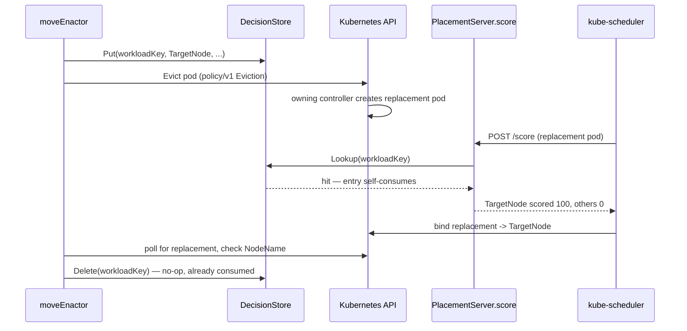
```mermaid
sequenceDiagram
    participant ME as moveEnactor
    participant DS as DecisionStore
    participant K8s as Kubernetes API
    participant PS as PlacementServer.score
    participant Sched as kube-scheduler

    ME->>DS: Put(workloadKey, TargetNode, ...)
    ME->>K8s: Evict pod (policy/v1 Eviction)
    K8s->>K8s: owning controller creates replacement pod
    Sched->>PS: POST /score (replacement pod)
    PS->>DS: Lookup(workloadKey)
    DS-->>PS: hit — entry self-consumes
    PS-->>Sched: TargetNode scored 100, others 0
    Sched->>K8s: bind replacement -> TargetNode
    ME->>K8s: poll for replacement, check NodeName
    ME->>DS: Delete(workloadKey) — no-op, already consumed
```

Kubernetes gives no direct way to pin a specific pod to a specific node through the normal
scheduling path — evicting a pod only tells its owning controller to create a replacement;
*where* that replacement lands is still kube-scheduler's own decision. [`decision_store.go`](decision_store.go)
(`internal/placement-server`) is how the rebalance engine influences that decision instead of
fighting it: a concurrency-safe, TTL-bounded (`DefaultDecisionStoreTTL` = 60s) in-memory map,
keyed by **workload identity** (`WorkloadKey(profile.Namespace, profile.Name)`), not by pod
name — the replacement pod has a different generated name than the one evicted, so there's no
pod-name correlation available at the moment it's scored.

`PlacementServer.score` (`server.go`) checks the store first, via `decisionStoreResponse`: a
live entry with `Action == Move` synthesizes a `DecisionResponse` that scores `TargetNode`
decisively (100) above every other candidate (0) — the same shape the AI agent would return —
instead of making a fresh AI call. A miss (the common case) falls through unchanged.

Lookup **self-consumes**: the entry is removed the moment any pod for that workload is scored,
not left live for the rest of the TTL. Without that, a concurrent, unrelated pod for the same
workload (e.g. a scale-up racing the rebalance cycle) could pick up the same node hint. The
enactor's own `Delete` at its terminal transition is therefore a no-op safety net for whichever
case reaches a terminal outcome without `score` ever having been called (e.g. the eviction never
produced a schedulable replacement) — TTL expiry is the final backstop for that same case.

One design consequence worth calling out: the AI sees the *entire* current placement every
call but the response only ever describes one action. Multi-pod convergence (e.g. two pods
need to move to actually balance the workload) is expected to happen over multiple Triggered
cycles — the AI recommends its single highest-value move this cycle, cooldown elapses, and if
the workload is still imbalanced the next cycle's request reflects the post-move layout and the
AI can recommend the next one. `recentDecisions` accumulates the history across cycles. Nothing
in the schema currently supports batching several decisions into one response, and the state
machine (one active decision per profile at a time) isn't shaped for concurrent per-pod cycles
either.

### Energy-gate-aware timeout classification

`moveEnactor` and `scaleEnactor` both end in a poll loop waiting for a scheduling-dependent
end-state: a replacement pod scheduled, or a target `ReadyReplicas` count reached. When that
poll times out, the cause is ambiguous by default — a defined outcome (`Failed`) the caller
writes to status, but one that can't distinguish "genuinely broken, needs investigation" from
"would have succeeded, this operator's own energy gate just happens to be closed right now."
That ambiguity was confirmed live, independently, for both `Move` and `AdjustReplicas`: a
workload's energy-aware profile had its energy window closed right as a replacement/new pod
tried to schedule, the enactor's poll saw nothing and reported `Failed`, and manually reopening
the window let the same pod schedule within seconds — proving the recommendation itself was
sound, only the timing was unlucky.

[`energy_gate.go`](energy_gate.go)'s `classifyScheduleTimeout` is called at the exact moment
either enactor's poll gives up, and only there — never on `Move`'s separate "replacement landed
on the wrong node" outcome, which is a real logic problem unrelated to scheduling delay, not a
timing issue:

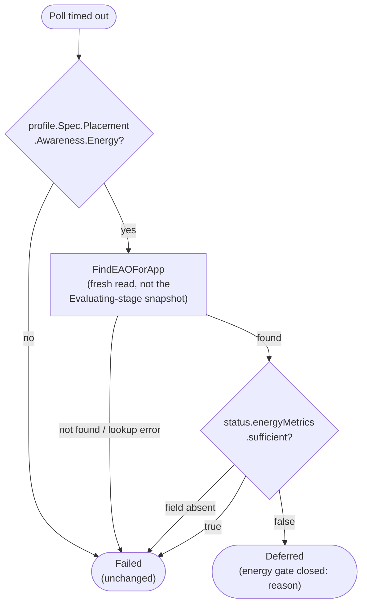
```mermaid
flowchart TD
    Timeout(["Poll timed out"]) --> Aware{"profile.Spec.Placement<br/>.Awareness.Energy?"}
    Aware -- no --> Failed(["Failed<br/>(unchanged)"])
    Aware -- yes --> Lookup["FindEAOForApp<br/>(fresh read, not the<br/>Evaluating-stage snapshot)"]
    Lookup -- "not found / lookup error" --> Failed
    Lookup -- found --> Sufficient{"status.energyMetrics<br/>.sufficient?"}
    Sufficient -- "field absent" --> Failed
    Sufficient -- "true" --> Failed
    Sufficient -- "false" --> Deferred(["Deferred<br/>(energy gate closed: reason)"])
```

Two things worth calling out:

- **The EAO is read fresh, at the moment of timeout** — not reused from the snapshot already
  sent to the AI during `Evaluating`. That snapshot is taken before the decision is even made;
  the gate can flip open or closed well within an enactor's own timeout window (default 60s), so
  only a read taken right here is trustworthy.
- **It mirrors `CheckEnergyGate`'s own gating precisely** (`internal/placement-server/
  builder.go`): `Awareness.Energy` is checked first, exactly like the gate itself does, so a
  workload the gate would never have blocked in the first place isn't misclassified just
  because some unrelated `EnergyAwareOrchestration` happens to exist and happens to report
  insufficient energy. Every "can't confirm" case falls back to the original `Failed` — this
  only ever reclassifies toward `Deferred` on a positive, direct signal, never guesses.

Out of scope: `resourceEnactor`'s best-effort in-place resize never goes through the
scheduler at all (it's a direct kubelet-level operation on an already-running pod), so the
energy gate can't explain a timeout there even in principle — and today `resourceEnactor`
doesn't wait for or track anything after submitting a resize request anyway, so it has no
timeout/`Failed` path to reclassify in the first place.

### Cluster-wide Move rate limit

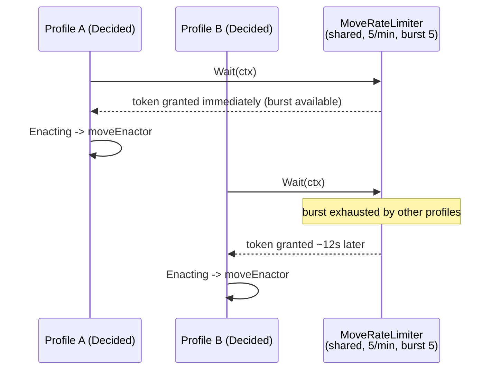
```mermaid
sequenceDiagram
    participant A as Profile A (Decided)
    participant B as Profile B (Decided)
    participant RL as MoveRateLimiter<br/>(shared, 5/min, burst 5)

    A->>RL: Wait(ctx)
    RL-->>A: token granted immediately (burst available)
    A->>A: Enacting -> moveEnactor

    B->>RL: Wait(ctx)
    Note over RL: burst exhausted by other profiles
    RL-->>B: token granted ~12s later
    B->>B: Enacting -> moveEnactor
```

Per-profile `cooldownSeconds` answers "how often can *this* workload act?" — it has no idea
what any other profile is doing. Nothing stops many independently-cooled-down profiles from
all landing an accepted `Move` in the same window (a shared `EnergyAwareOrchestration` slot
opening, a node going `NotReady` and affecting everything scheduled on it) and all reaching
`Enacting` — evicting real running pods — at once. `MoveRateLimiter` (in `reconciler.go`) is
the backstop for that: a single `golang.org/x/time/rate.Limiter`, shared across every profile,
gating only `dispatchMove`'s `Decided → Enacting` step. `RetryPendingSchedule` is **not**
gated — it deletes an already-unscheduled pod, not a running one, so it doesn't need
fleet-wide throttling the way an eviction does.

Token bucket, not a fixed-window counter: burst equals the per-minute limit itself
(`DefaultMoveRateLimit`, 5), so a quiet fleet can absorb a full minute's budget immediately,
then throttles to a steady trickle (one token every `60/limit` seconds) after that.

**The wait blocks synchronously, inside the same `dispatchMove` call, on purpose.** The
alternative — give up immediately, requeue, and let some later `Reconcile` resume from
`Decided` — was considered and rejected: that later call would have nothing but a free-text
`details` string to reconstruct the pending `podName`/`targetNode`/`reason` from (no
structured pending-action fields exist on `RebalancingStatus`), and would need `Reconcile`'s
in-flight guard taught a new "Decided sometimes means resume, not skip" special case. Blocking
avoids all of that: the goroutine that already has the AI's response in hand is the one that
eventually proceeds, so nothing needs to be reconstructed. `MoveRateWaitTimeout` (default 5
minutes — deliberately generous, not a "fail fast" bound) exists so this is a rare safety
valve for a genuinely starved budget, not the normal path: since the bucket always refills
eventually, a long wait almost always succeeds within the original call, meaning the AI is
consulted once per Move, not once per retry.

Blocking a reconcile worker for minutes has a real cost, though: with controller-runtime's
default `MaxConcurrentReconciles` (1), one profile waiting on a token would stall *every other
profile's* reconciliation too, even ones with nothing to do with Move. `SetupWithManager`
raises this to `DefaultMaxConcurrentReconciles` (10) specifically to absorb that — sized
comfortably above the rate limiter's own burst (5) rather than scaled to fleet size, since the
number of profiles that can simultaneously be blocked in `Wait` is bounded by the limiter's
own throughput, not by how many profiles exist.

**A rate-limited Move deliberately does not apply the profile's cooldown**, unlike every other
`Failed` exit in `dispatch.go`. The profile didn't lose on its merits — it lost a scheduling
race against other profiles' Moves. `cooldownSeconds` can be minutes; the limiter's own budget
refills in seconds, so applying the normal cooldown would leave a still-valid Move idle long
after capacity actually freed up. This is safe specifically because `Wait()` itself already
blocks (up to `MoveRateWaitTimeout`) before failing — that blocking *is* the pacing, so
skipping cooldown here doesn't risk the sub-second self-triggering loop a missing cooldown
caused elsewhere (see `hasPendingPod`'s doc comment in `triggers.go` for that story).

### Dry-run mode

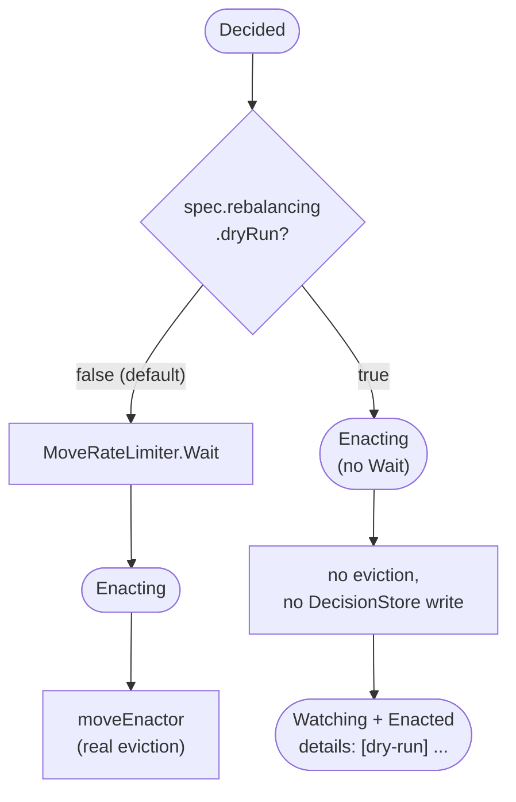
```mermaid
flowchart TD
    D(["Decided"]) --> Q{"spec.rebalancing<br/>.dryRun?"}
    Q -- "false (default)" --> RL["MoveRateLimiter.Wait"] --> Enacting1(["Enacting"]) --> ME["moveEnactor<br/>(real eviction)"]
    Q -- true --> Enacting2(["Enacting<br/>(no Wait)"]) --> Sim["no eviction,<br/>no DecisionStore write"]
    Sim --> W(["Watching + Enacted<br/>details: [dry-run] ..."])
```

`spec.rebalancing.dryRun: true` runs the full lifecycle — including the AI consultation and
every guardrail — but skips a `Move`'s real side effects. The improvement-threshold and
malformed-response guardrails in `dispatchMove` still apply exactly as they do live, so a
below-threshold or malformed recommendation still ends `Rejected`/`Failed`: those outcomes
genuinely happened. Only a recommendation that clears every guardrail takes the simulated
path (`dispatchMoveDryRun`) — `Decided → Enacting → Watching` with outcome `Enacted` and
`details` prefixed `[dry-run]`, without calling `moveEnactor` or touching `DecisionStore`.

It also skips `MoveRateLimiter.Wait` — a dry run never evicts anything, so it shouldn't
consume or wait on the fleet's real eviction-rate budget alongside profiles doing live Moves.
Every transition still emits its usual Kubernetes Event (`StateWriter.emitEvent` fires
unconditionally), so `kubectl describe` shows exactly what a dry run decided without any
special-casing there.

`Move` and `AdjustReplicas` each have their own dry-run branch (`dispatchMoveDryRun` /
`dispatchScaleDryRun`) — there's no shared helper between them, since what "the real side
effect" means differs per action. Any future enactor (`AdjustResources`, `Defer`, `Escalate`)
will need its own the same way.

### Replica bounds — `AdjustReplicas`

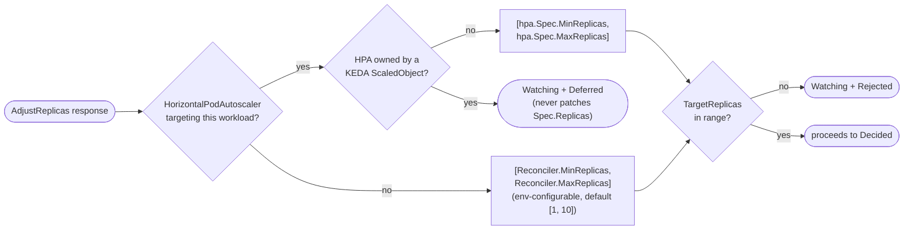
```mermaid
flowchart LR
    Resp(["AdjustReplicas response"]) --> Q{"HorizontalPodAutoscaler<br/>targeting this workload?"}
    Q -- yes --> Owner{"HPA owned by a<br/>KEDA ScaledObject?"}
    Q -- no --> Def["[Reconciler.MinReplicas,<br/>Reconciler.MaxReplicas]<br/>(env-configurable, default [1, 10])"]
    Owner -- yes --> Deferred(["Watching + Deferred<br/>(never patches Spec.Replicas)"])
    Owner -- no --> HPA["[hpa.Spec.MinReplicas,<br/>hpa.Spec.MaxReplicas]"]
    HPA --> Check{"TargetReplicas<br/>in range?"}
    Def --> Check
    Check -- no --> Rej(["Watching + Rejected"])
    Check -- yes --> OK(["proceeds to Decided"])
```

`resolveReplicaBounds` ([`scale_enactor.go`](scale_enactor.go)) decides how far `dispatchScale`
lets a recommendation move a workload's replica count. A `HorizontalPodAutoscaler` whose
`spec.scaleTargetRef` names the same workload (matched by kind + name — `scaleTargetRef` has no
namespace field, so it's implicitly the HPA's own namespace) is authoritative: it's the
standard, pre-existing place a user already expresses "how far this workload may scale," so
honouring it avoids introducing a second, competing bound the user would have to keep in sync.
No matching HPA falls back to `Reconciler.MinReplicas`/`MaxReplicas` (`REBALANCE_MIN_REPLICAS` /
`REBALANCE_MAX_REPLICAS`, default `[1, 10]`) — deliberately conservative, meant to stop a
misbehaving or overly aggressive AI response from scaling to zero or to something absurd, not
to express real capacity planning for any given workload.

**KEDA-managed workloads are deferred to entirely, not just bounded.** KEDA doesn't scale a
workload's replicas directly — it creates and drives a real `HorizontalPodAutoscaler` of its
own, fed by its custom metrics adapter instead of CPU/memory. That generated HPA's
`ownerReferences` point back to the `ScaledObject` that created it, so a found HPA is checked
for KEDA ownership (`Kind: ScaledObject, apiVersion: keda.sh/v1alpha1`) — no new RBAC or CRD
scheme registration needed, since it only inspects an HPA object already fetched for bounds. If
KEDA-owned, `dispatchScale` never calls `scaleEnactor` at all: the cycle ends `Watching` +
`Deferred` with a reason naming the owning `ScaledObject`. Patching `Spec.Replicas` on a
KEDA-managed workload would just compete with KEDA's own reconcile loop — whichever writes most
recently wins, and they'd flap back and forth — so stepping back entirely, rather than trying to
coexist, is the only safe option available without a deeper KEDA integration (not built).

<a id="adjustresources--cpumemory"></a>
### AdjustResources — CPU/Memory

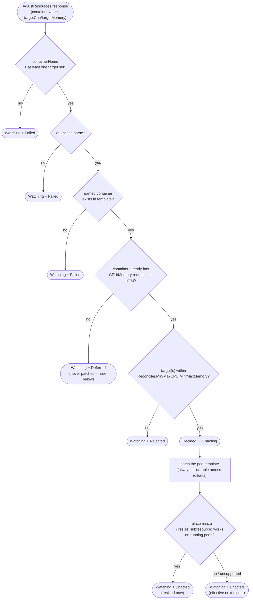
```mermaid
flowchart TD
    Resp(["AdjustResources response<br/>(containerName, targetCpu/targetMemory)"]) --> Named{"containerName<br/>+ at least one target set?"}
    Named -- no --> Failed1(["Watching + Failed"])
    Named -- yes --> Parse{"quantities parse?"}
    Parse -- no --> Failed2(["Watching + Failed"])
    Parse -- yes --> Found{"named container<br/>exists in template?"}
    Found -- no --> Failed3(["Watching + Failed"])
    Found -- yes --> Existing{"container already has<br/>CPU/Memory requests or limits?"}
    Existing -- no --> Deferred(["Watching + Deferred<br/>(never patches — see below)"])
    Existing -- yes --> Bounds{"target(s) within<br/>Reconciler.Min/MaxCPU,Min/MaxMemory?"}
    Bounds -- no --> Rejected(["Watching + Rejected"])
    Bounds -- yes --> Decided(["Decided → Enacting"])
    Decided --> Patch["patch the pod template<br/>(always — durable across rollouts)"]
    Patch --> Resize{"in-place resize<br/>('resize' subresource) works<br/>on running pods?"}
    Resize -- yes --> Enacted1(["Watching + Enacted<br/>(resized now)"])
    Resize -- no / unsupported --> Enacted2(["Watching + Enacted<br/>(effective next rollout)"])
```

Unlike Move and AdjustReplicas, the AI doesn't get to pick *which* container implicitly — a
workload can have any number of containers, so `RebalanceDecisionResponse.ContainerName` names
the exact one, matched by name (not position) in `resourceEnactor`
([`resource_enactor.go`](resource_enactor.go)). The AI sees each pod's container names and
current CPU/Memory (`RebalanceContext.CurrentPlacements[].Containers`, built by
`buildContainerInfo` in `internal/placement-server/builder.go`) specifically so it can name one
back and reason about its current values instead of proposing a change blind.

**A container with no existing CPU/Memory requests or limits at all is deferred, not
patched.** Such a container is deliberately left unconstrained by whoever wrote its spec — it
already scales elastically within whatever the node has free, with no ceiling to adjust.
Imposing brand-new requests/limits on it wouldn't be an *adjustment*, it would be a first-time
resource constraint, and would silently flip its QoS class from `BestEffort` to `Guaranteed` — a
bigger, different decision than this action is meant to make on its own. `dispatchResource`
checks this (`resolveResourceState`) before ever reaching `Decided`, the same guardrail shape as
the KEDA-managed check above.

**Bounds** (`Reconciler.MinCPU/MaxCPU/MinMemory/MaxMemory`, env `REBALANCE_MIN_CPU` /
`REBALANCE_MAX_CPU` / `REBALANCE_MIN_MEMORY` / `REBALANCE_MAX_MEMORY`, defaults `50m`–`2` CPU and
`64Mi`–`2Gi` Memory) are env-var/default only — unlike replica bounds, no existing cluster object
is consulted. A per-workload CPU/Memory autoscaler (VPA) is a separate CRD this module doesn't
already depend on; pulling it in for this guardrail was deliberately out of scope.

**In-place resize is best-effort, not guaranteed.** `resourceEnactor` always patches the
workload's pod template first — that alone guarantees the target resources apply eventually (the
next rollout), regardless of cluster support. It then attempts the Kubernetes 1.27+
`InPlacePodVerticalScaling` `resize` subresource against every currently-running pod matching the
workload's selector, so an already-running pod can pick up the change immediately where
supported. A resize failure on a given pod (most commonly: the cluster doesn't support in-place
resize at all) is **not** a `Failed` outcome — the template patch already durably applies, so the
cycle still ends `Enacted`, just with a reason noting the change takes effect on the next
rollout instead.

**A pod only counts as resized once its status actually confirms it** — submitting the resize
request successfully only means the API server accepted the write, not that the kubelet applied
it. `awaitResizeConvergence` polls the pod (every `resizeActionPollInterval` = 2s, within the
same shared `timeout` budget the whole batch of pods shares) for one of three outcomes:
`ContainerStatus.Resources` (what's actually enacted, not merely requested or allocated) matches
the target — converged; a `PodResizePending`/`Infeasible` or `PodResizeInProgress`/`Error`
condition appears — the kubelet has definitively rejected it, no point waiting further;
otherwise the shared budget eventually runs out — unconfirmed, not a rejection, just "don't know
yet." Only the first case counts toward `resized`; the other two both fall back to the same
next-rollout guarantee the template patch already provides. A `PodResizePending`/`Deferred`
condition (feasible, just not possible on this node *right now*) is deliberately not treated as
a rejection — it may still resolve within the shared budget.

Only CPU and Memory are supported — every other resource type (GPU and other extended/device
resources included) is immutable on a running pod regardless of `InPlacePodVerticalScaling`, so
adjusting one always means a full pod replacement, the same disruption profile as `Move` rather
than a variant of this enactor. Deliberately out of scope here; a future story would need its own
design.

<a id="node-pressure-cpumemory"></a>
## 📊 <u>Node pressure (CPU/Memory)</u>

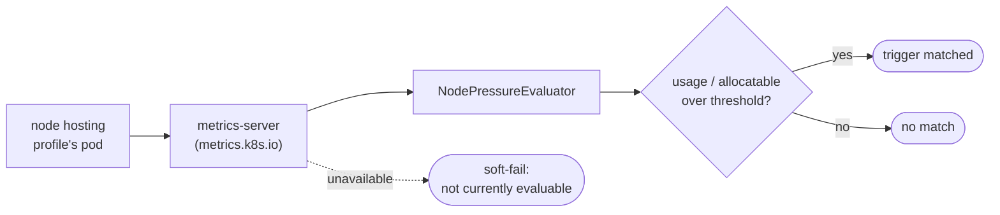
```mermaid
flowchart LR
    Node["node hosting<br/>profile's pod"] --> MS["metrics-server<br/>(metrics.k8s.io)"]
    MS --> NPE["NodePressureEvaluator"]
    NPE --> Cmp{"usage / allocatable<br/>over threshold?"}
    Cmp -- yes --> Match(["trigger matched"])
    Cmp -- no --> NoMatch(["no match"])
    MS -. unavailable .-> Soft(["soft-fail:<br/>not currently evaluable"])
```

[`pressure.go`](pressure.go)'s `NodePressureEvaluator` answers a node-level question — "is
the node this pod happens to be on under enough pressure that moving away would help" — not
a pod-level one. A node can be under pressure entirely because of *other* workloads; that's
exactly the case rebalancing should react to.

It uses **live usage from metrics-server** (`metrics.k8s.io`), not resource *requests* — a
real signal, not a static heuristic. `EvaluateCPUPressure` and `EvaluateMemoryPressure` are
independent, self-contained methods (each does its own Node-get + NodeMetrics-get); they're
not merged into one combined fetch because metrics-server always returns both resources in a
single response anyway, so there's no real fetch cost to save by combining — only coupling
to avoid in the trigger dispatch `switch`.

metrics-server is an optional cluster component (see
[deployment](../../hack/install_metrics_server.sh)). If it's not installed, both methods
return an error, which `TriggerEvaluator` catches and treats as "not currently evaluable" —
`CPUThreshold`/`MemoryThreshold` simply never fire until it's present.

Default threshold: 90% (`DefaultNodePressureThreshold`).

<a id="statewriter--the-single-writer-rule"></a>
## ✍️ <u>`StateWriter` — the single-writer rule</u>

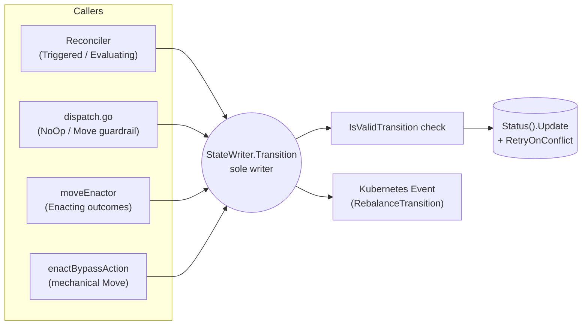
```mermaid
flowchart LR
    subgraph Callers
        RC["Reconciler<br/>(Triggered / Evaluating)"]
        DP["dispatch.go<br/>(NoOp / Move guardrail)"]
        ME["moveEnactor<br/>(Enacting outcomes)"]
        EB["enactBypassAction<br/>(mechanical Move)"]
    end
    RC --> SW(("StateWriter.Transition<br/>sole writer"))
    DP --> SW
    ME --> SW
    EB --> SW
    SW --> Validate["IsValidTransition check"]
    Validate --> API[("Status().Update<br/>+ RetryOnConflict")]
    SW --> Event["Kubernetes Event<br/>(RebalanceTransition)"]
```

This is a hard architectural rule, not a convention: **no code anywhere in this codebase may
mutate `status.rebalancingStatus` except through `StateWriter.Transition`.** Every stage of
the engine must go through it. This is what makes the engine's status trustworthy enough to
build a UI or alerting on top of later.

`Transition` (in [`writer.go`](writer.go)):

1. Re-fetches the profile (via an **uncached** reader, `mgr.GetAPIReader()` — not
   `mgr.GetClient()`) and validates the move against `IsValidTransition` — an illegal
   transition is rejected with an error, not silently coerced.
2. On entering `Triggered`: assigns a fresh `decisionId` (UUID) and resets the previous
   cycle's `action`/`details`.
3. On transitioning to `Watching`: requires `TransitionOptions.Outcome` (rejects the call
   otherwise), sets `cooldownUntil` (if a cooldown was passed in), and prepends a record to
   `recentDecisions` carrying that outcome, trimmed to `MaxRecentDecisions` (10).
4. Persists via `Status().Update`, wrapped in `retry.RetryOnConflict` — callers never need
   their own conflict-retry loop, and re-applying the same transition after a crash is safe
   (it either no-ops because state already moved on, or succeeds idempotently).
5. Emits a Kubernetes Event (`RebalanceTransition` reason) on the `OrchestrationProfile`
   object — a transition to `Watching` with outcome `Failed`/`Rejected`/`Deferred` is a
   `Warning`, everything else is `Normal`. These show up in `kubectl describe
   orchestrationprofile <name>` interleaved with the existing `PlacementActive`/
   `PlacementDegraded`/etc. events from the main controller, distinguished by the `FROM`
   column (`rebalance-engine` vs `orchestrationprofile-controller`).

### Why the reader must be uncached

Found the hard way: `enactBypassAction` calls `Transition` five times back-to-back within one
`Reconcile` (`Triggered → Evaluating → Decided → Enacting → Watching`, outcome `Enacted` or
`Failed`). Each call
independently re-fetches the profile to determine the current state before validating the
move. `Status().Update` always writes straight to the API server — but `mgr.GetClient()`'s
`Get()` reads from the **local informer cache**, which only catches up after an asynchronous
watch round-trip. The write from step *N* had already landed on the server, but the cache
hadn't observed it yet by the time step *N+1* asked — so it read the state from *two steps
back*, and rejected an otherwise-valid transition with `invalid transition "X" -> "Y"`. Using
`mgr.GetAPIReader()` (a direct, uncached client) for the read side fixes this for every
chained-transition sequence, not just this one — `evaluateWithAI`'s `Triggered → Evaluating`
sequence, and the future `Decided → Enacting` sequence once an AI-recommended action actually
gets dispatched, chain calls the same way.

This class of bug can't be caught by the fake-client unit tests in this package — the fake
client isn't cache-based, so writes are immediately visible to the next `Get()`, which is
exactly the behavior that masked this in testing. Catching it required a real cluster with
the real manager cache.

### Watchdog for a profile stuck in a non-Watching state

`Reconcile` skips detection entirely whenever `state != Watching` (`Triggered`, `Evaluating`,
`Decided`, `Enacting`) — deliberately, so it doesn't re-trigger a cycle that's still in flight.
Every path that can enter the state machine also has a defined way back to `Watching` —
AI-unreachable (`failEvaluation`), guardrail-rejected/unrecognized-action/malformed-Move
(`dispatchDecision`), and an enactor's outcome (`moveEnactor`/`scaleEnactor`/`resourceEnactor`),
each ending in a terminal `Watching` write with an outcome.

The gap is `enactBypassAction` and `dispatchMove` (and friends) driving several `Transition`
calls sequentially *within a single `Reconcile` call*. If the operator process dies exactly
between two of those calls (e.g. mid-rollout), the profile is abandoned wherever it was — and
`Reconcile`'s in-flight guard would otherwise skip it forever, since nothing else revisits a
non-`Watching` state on its own.

`recoverStuckCycle` (called from that same in-flight guard, on every reconcile of a non-Watching
profile) closes this: once `time.Since(LastTransitionAt)` clears `WatchdogStaleThreshold`
(default 15 minutes — comfortably above every legitimate in-cycle wait, `MoveRateWaitTimeout`'s 5
minutes being the longest), it force-transitions the profile straight to `Watching` with outcome
`Failed` and the profile's own cooldown applied, so a still-true trigger condition doesn't
immediately re-enter `Triggered` and crash-loop through the same failure. A cycle that's still
genuinely progressing — `LastTransitionAt` recent — is left alone.

### Escalation — pausing on repeated failures

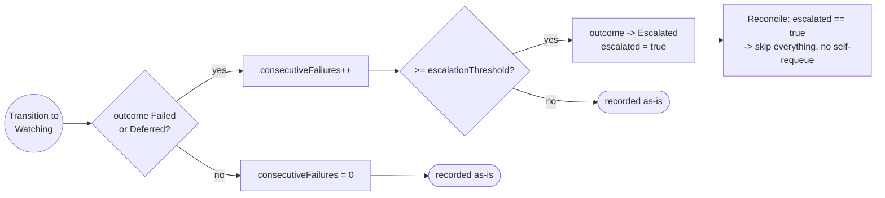
```mermaid
flowchart LR
    T(("Transition to<br/>Watching")) --> Streak{"outcome Failed<br/>or Deferred?"}
    Streak -- yes --> Inc["consecutiveFailures++"]
    Streak -- no --> Reset["consecutiveFailures = 0"]
    Inc --> Cross{">= escalationThreshold?"}
    Cross -- yes --> Promote["outcome -> Escalated<br/>escalated = true"]
    Cross -- no --> Done1(["recorded as-is"])
    Reset --> Done2(["recorded as-is"])
    Promote --> Pause["Reconcile: escalated == true<br/>-> skip everything, no self-requeue"]
```

Two independent things can happen when a cycle ends back at `Watching`, both handled inside
`StateWriter.Transition`'s existing terminal-write branch — no dispatcher/enactor needed to know
about either:

1. **The streak.** `rs.ConsecutiveFailures` increments on outcome `Failed`/`Deferred`, and resets
   to 0 on anything else (`Enacted`/`NoOp`/`Rejected`/`Escalated`). Deliberately *consecutive*, not
   windowed — any non-repeat outcome in between is proof the workload can still be acted on
   normally, so the count starts over. Once it reaches `profile.Spec.Rebalancing
   .EscalationThreshold` (`<= 0` uses `DefaultEscalationThreshold` = 3), *that same cycle's*
   outcome is promoted from `Failed`/`Deferred` to `Escalated` — the real failure reason is kept in
   the recorded `reason` text, just folded into the escalation message instead of standing alone.
2. **A direct request.** The AI can also return `Escalate` itself (`dispatchEscalate`, mirroring
   `dispatchNoOp` — see [Dispatch](#dispatch--acting-on-the-ais-decision)), which arrives at
   `Transition` already carrying outcome `Escalated` and skips the streak check entirely — the
   AI's own judgment doesn't need to wait for a repeat-failure count to catch up.

Either path sets the same persistent `rs.Escalated` flag (+ `EscalatedReason`) — unlike
`RecentDecisions`, which is a rolling window, this flag survives until something explicitly
clears it. `Reconcile` checks it first thing, right next to the `Spec.Rebalancing.Enabled` check:
while `Escalated`, the profile is skipped entirely — no trigger evaluation, no bypass actions
either (a stronger pause than cooldown, which deliberately still lets `RetryPendingSchedule`
through) — and no self-requeue, since there's nothing to do until a human acts; the primary watch
already wakes `Reconcile` the moment status changes.

**Clearing it** is a plain status patch, same shape as the watchdog recovery above:

```
kubectl patch orchestrationprofile <name> --subresource=status \
  -p '{"status":{"rebalancingStatus":{"escalated":false,"consecutiveFailures":0}}}'
```

Resetting `consecutiveFailures` alongside `escalated` is optional but recommended — otherwise a
single subsequent failure could immediately re-cross an already-close-to-threshold count. The
flag is intentionally never cleared automatically: auto-clearing would defeat the point of
requiring a human to have actually looked at it.

<a id="wiring-into-the-system"></a>
## 🔌 <u>Wiring into the system</u>

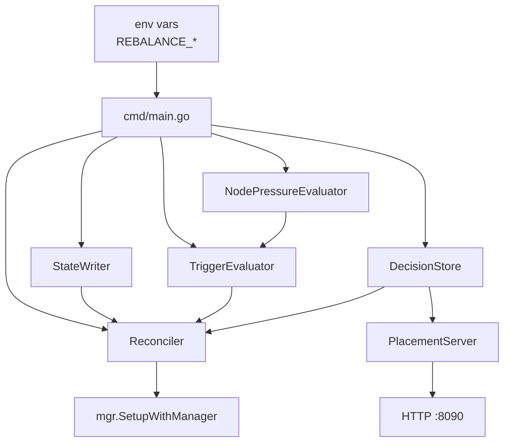
```mermaid
flowchart TD
    Env["env vars<br/>REBALANCE_*"] --> Main["cmd/main.go"]
    Main --> SW2["StateWriter"]
    Main --> DS2["DecisionStore"]
    Main --> NPE2["NodePressureEvaluator"]
    Main --> TE2["TriggerEvaluator"]
    Main --> Recon["Reconciler"]
    SW2 --> Recon
    NPE2 --> TE2
    TE2 --> Recon
    DS2 --> Recon
    DS2 --> PS2["PlacementServer"]
    Recon --> Mgr["mgr.SetupWithManager"]
    PS2 --> HTTP["HTTP :8090"]
```

Everything below runs inside the **same operator process** — one binary, one Deployment, one
pod. Wired in `cmd/main.go`:

```go
// Each of these is parsed from an environment variable and resolved to the
// package default (rebalance.DefaultX) right here in main.go if unset or
// <= 0 — so every log line and downstream constructor call sees the value
// actually in effect, never the raw "0 means unset" sentinel.
rebalanceMaxRecentDecisions := parseIntEnv("REBALANCE_MAX_RECENT_DECISIONS")      // -> rebalance.DefaultMaxRecentDecisions
rebalanceDetectionInterval := parseDurationEnv("REBALANCE_DETECTION_INTERVAL")    // -> rebalance.DefaultDetectionInterval
rebalanceDecisionTimeout := parseDurationEnv("REBALANCE_DECISION_TIMEOUT")        // -> rebalance.DefaultDecisionTimeout
rebalanceNodePressureThreshold := parseFloatEnv("REBALANCE_NODE_PRESSURE_THRESHOLD") // -> rebalance.DefaultNodePressureThreshold
rebalanceImprovementThreshold := parseFloatEnv("REBALANCE_IMPROVEMENT_THRESHOLD") // -> rebalance.DefaultImprovementThreshold
rebalanceDecisionStoreTTL := parseDurationEnv("REBALANCE_DECISION_STORE_TTL")     // -> placementserver.DefaultDecisionStoreTTL
rebalanceMoveActionTimeout := parseDurationEnv("REBALANCE_MOVE_ACTION_TIMEOUT")   // -> rebalance.DefaultMoveActionTimeout
rebalanceMoveRateLimit := parseIntEnv("REBALANCE_MOVE_RATE_LIMIT")                // -> rebalance.DefaultMoveRateLimit

rebalanceWriter := rebalance.NewStateWriter(
    mgr.GetClient(), mgr.GetAPIReader(), mgr.GetEventRecorderFor("rebalance-engine"),
    rebalanceMaxRecentDecisions,
)
rebalanceEngine := rebalance.NewEngine(mgr.GetClient(), rebalanceWriter)
mgr.Add(rebalanceEngine)

// decisionStore is shared between PlacementServer (reads it in score) and the
// rebalance engine's Move enactor (writes to it before eviction) — both live
// in this same operator binary.
decisionStore := placementserver.NewDecisionStore(rebalanceDecisionStoreTTL)

metricsClient, _ := metricsclientset.NewForConfig(restConfig)
pressureEvaluator := rebalance.NewNodePressureEvaluator(mgr.GetClient(), metricsClient, rebalanceNodePressureThreshold)
triggerEvaluator := rebalance.NewTriggerEvaluator(mgr.GetClient(), eaoGVK, pressureEvaluator)

// contextBuilder and decisionClient are the same instances the placement server
// uses for initial-placement scoring — the rebalance engine's AI consultation is
// a second use of the one configured External AI Agent, not a parallel HTTP path.
rebalanceDetector := rebalance.NewReconciler(
    mgr.GetClient(), rebalanceWriter, triggerEvaluator,
    controller.ProfileByAppRefIndex, rebalanceDetectionInterval,
    contextBuilder, decisionClient, rebalanceDecisionTimeout,
    rebalanceImprovementThreshold, decisionStore, rebalanceMoveActionTimeout,
    rebalanceMoveRateLimit,
)
rebalanceDetector.SetupWithManager(mgr, eaoItemGVK)

// decisionStore is also passed to NewPlacementServer so score() can read it.
```

### Configuration

Every numeric default in this package is overridable at deploy time — none of it needs a code
change or rebuild to tune for a given cluster:

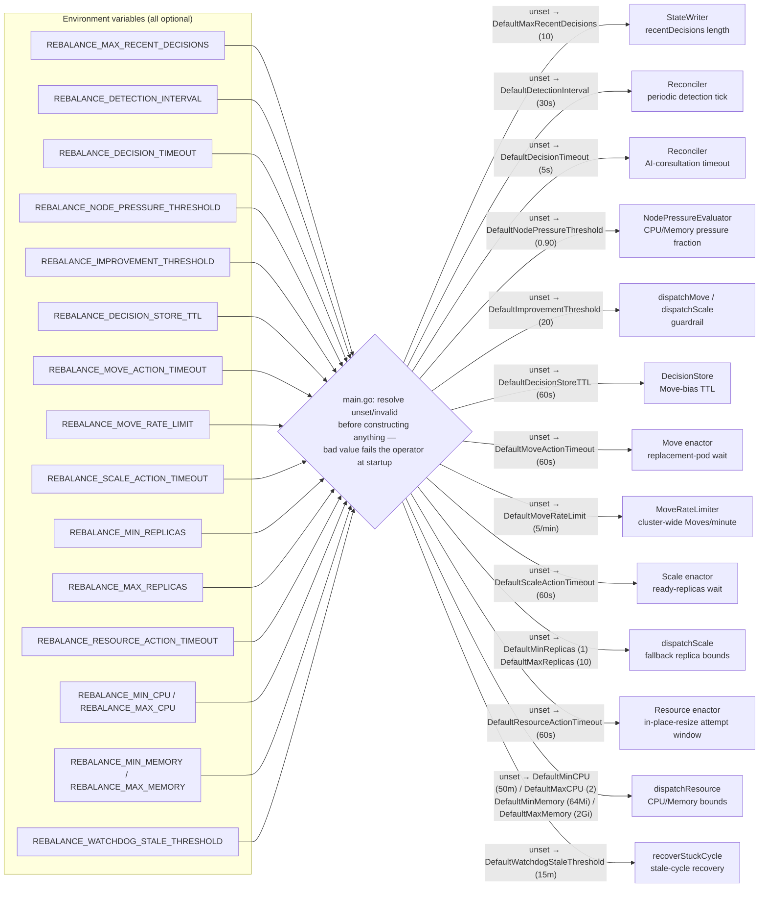
```mermaid
flowchart LR
    subgraph EnvVars["Environment variables (all optional)"]
        direction TB
        V1["REBALANCE_MAX_RECENT_DECISIONS"]
        V2["REBALANCE_DETECTION_INTERVAL"]
        V3["REBALANCE_DECISION_TIMEOUT"]
        V4["REBALANCE_NODE_PRESSURE_THRESHOLD"]
        V5["REBALANCE_IMPROVEMENT_THRESHOLD"]
        V6["REBALANCE_DECISION_STORE_TTL"]
        V7["REBALANCE_MOVE_ACTION_TIMEOUT"]
        V8["REBALANCE_MOVE_RATE_LIMIT"]
        V9["REBALANCE_SCALE_ACTION_TIMEOUT"]
        V10["REBALANCE_MIN_REPLICAS"]
        V11["REBALANCE_MAX_REPLICAS"]
        V12["REBALANCE_RESOURCE_ACTION_TIMEOUT"]
        V13["REBALANCE_MIN_CPU / REBALANCE_MAX_CPU"]
        V14["REBALANCE_MIN_MEMORY / REBALANCE_MAX_MEMORY"]
        V15["REBALANCE_WATCHDOG_STALE_THRESHOLD"]
    end

    Resolve{"main.go: resolve unset/invalid<br/>before constructing anything —<br/>bad value fails the operator at startup"}

    V1 --> Resolve
    V2 --> Resolve
    V3 --> Resolve
    V4 --> Resolve
    V5 --> Resolve
    V6 --> Resolve
    V7 --> Resolve
    V8 --> Resolve
    V9 --> Resolve
    V10 --> Resolve
    V11 --> Resolve
    V12 --> Resolve
    V13 --> Resolve
    V14 --> Resolve
    V15 --> Resolve

    Resolve -->|"unset → DefaultMaxRecentDecisions (10)"| SW["StateWriter<br/>recentDecisions length"]
    Resolve -->|"unset → DefaultDetectionInterval (30s)"| Recon1["Reconciler<br/>periodic detection tick"]
    Resolve -->|"unset → DefaultDecisionTimeout (5s)"| Recon2["Reconciler<br/>AI-consultation timeout"]
    Resolve -->|"unset → DefaultNodePressureThreshold (0.90)"| NPE["NodePressureEvaluator<br/>CPU/Memory pressure fraction"]
    Resolve -->|"unset → DefaultImprovementThreshold (20)"| Disp["dispatchMove / dispatchScale<br/>guardrail"]
    Resolve -->|"unset → DefaultDecisionStoreTTL (60s)"| DS["DecisionStore<br/>Move-bias TTL"]
    Resolve -->|"unset → DefaultMoveActionTimeout (60s)"| ME["Move enactor<br/>replacement-pod wait"]
    Resolve -->|"unset → DefaultMoveRateLimit (5/min)"| RL["MoveRateLimiter<br/>cluster-wide Moves/minute"]
    Resolve -->|"unset → DefaultScaleActionTimeout (60s)"| SE["Scale enactor<br/>ready-replicas wait"]
    Resolve -->|"unset → DefaultMinReplicas (1)<br/>DefaultMaxReplicas (10)"| SB["dispatchScale<br/>fallback replica bounds"]
    Resolve -->|"unset → DefaultResourceActionTimeout (60s)"| RE["Resource enactor<br/>in-place-resize attempt window"]
    Resolve -->|"unset → DefaultMinCPU (50m) / DefaultMaxCPU (2)<br/>DefaultMinMemory (64Mi) / DefaultMaxMemory (2Gi)"| RB["dispatchResource<br/>CPU/Memory bounds"]
    Resolve -->|"unset → DefaultWatchdogStaleThreshold (15m)"| WD["recoverStuckCycle<br/>stale-cycle recovery"]
```

| Environment variable | Overrides | Default |
|---|---|---|
| `REBALANCE_MAX_RECENT_DECISIONS` | `StateWriter`'s rolling decision-history length | `DefaultMaxRecentDecisions` (10) |
| `REBALANCE_DETECTION_INTERVAL` | `Reconciler`'s periodic detection tick (Go duration, e.g. `30s`) | `DefaultDetectionInterval` (30s) |
| `REBALANCE_DECISION_TIMEOUT` | `Reconciler`'s AI-consultation timeout (Go duration, e.g. `5s`) | `DefaultDecisionTimeout` (5s) |
| `REBALANCE_NODE_PRESSURE_THRESHOLD` | `NodePressureEvaluator`'s CPU/Memory pressure fraction (e.g. `0.90`) | `DefaultNodePressureThreshold` (0.90) |
| `REBALANCE_IMPROVEMENT_THRESHOLD` | `dispatchMove`/`dispatchScale`'s guardrail — minimum `Improvement` to enact | `DefaultImprovementThreshold` (20) |
| `REBALANCE_DECISION_STORE_TTL` | How long a `Move` decision biases `PlacementServer.score` (Go duration) | `placementserver.DefaultDecisionStoreTTL` (60s) |
| `REBALANCE_MOVE_ACTION_TIMEOUT` | Max wait for a `Move`'s replacement pod to be scheduled (Go duration) | `DefaultMoveActionTimeout` (60s) |
| `REBALANCE_MOVE_RATE_LIMIT` | Cluster-wide cap on Moves/minute across every profile (see [Cluster-wide Move rate limit](#cluster-wide-move-rate-limit)) | `DefaultMoveRateLimit` (5) |
| `REBALANCE_SCALE_ACTION_TIMEOUT` | Max wait for an `AdjustReplicas` rollout to report ready (Go duration) | `DefaultScaleActionTimeout` (60s) |
| `REBALANCE_MIN_REPLICAS` | `AdjustReplicas` fallback lower bound when no HPA targets the workload (see [Replica bounds](#replica-bounds--adjustreplicas)) | `DefaultMinReplicas` (1) |
| `REBALANCE_MAX_REPLICAS` | `AdjustReplicas` fallback upper bound when no HPA targets the workload (see [Replica bounds](#replica-bounds--adjustreplicas)) | `DefaultMaxReplicas` (10) |
| `REBALANCE_RESOURCE_ACTION_TIMEOUT` | Max time `resourceEnactor` spends attempting in-place resize before falling back to the next-rollout path (Go duration) | `DefaultResourceActionTimeout` (60s) |
| `REBALANCE_MIN_CPU` / `REBALANCE_MAX_CPU` | `AdjustResources` CPU bounds (see [AdjustResources](#adjustresources--cpumemory)) | `DefaultMinCPU` (50m) / `DefaultMaxCPU` (2) |
| `REBALANCE_MIN_MEMORY` / `REBALANCE_MAX_MEMORY` | `AdjustResources` Memory bounds (see [AdjustResources](#adjustresources--cpumemory)) | `DefaultMinMemory` (64Mi) / `DefaultMaxMemory` (2Gi) |
| `REBALANCE_WATCHDOG_STALE_THRESHOLD` | How long a profile may sit in a non-Watching state before force-recovery (see [Watchdog for a profile stuck in a non-Watching state](#watchdog-for-a-profile-stuck-in-a-non-watching-state)) | `DefaultWatchdogStaleThreshold` (15m) |

Each default lives once, as a constant next to the type it configures — `main.go` doesn't
duplicate the numbers, it just resolves "unset" to that constant before constructing anything,
so the startup log always shows the value actually in effect rather than a misleading `0`. An
unparseable value (bad duration/float/int) fails the operator at startup rather than silently
falling back, since a typo here should be caught at deploy time, not discovered later as
unexplained behavior.

Two related settings are deliberately **not** environment-configurable, unlike everything
above: `MoveRateWaitTimeout` (default 5 minutes — a settable `Reconciler` field for tests, same
as `MoveActionTimeout`, but not wired to an env var) and `DefaultMaxConcurrentReconciles` (10,
a plain constant used directly in `SetupWithManager`). Both are operational tuning for the
rate limiter's own blocking behavior rather than per-cluster business logic — see
[Cluster-wide Move rate limit](#cluster-wide-move-rate-limit).

- `controller.ProfileByAppRefIndex` — the same field index the `OrchestrationProfile`
  controller already registers (`internal/controller/op_index.go`), reused rather than
  duplicated. `internal/rebalance` does **not** import `internal/controller` directly; the
  index field name is passed in as a string constructor argument, mirroring the same
  decoupling convention `internal/placement-server` already uses.
- `eaoGVK` in `main.go` is the *List* kind (`...List`), used for `List()` calls in both the
  placement server and `TriggerEvaluator`. `Reconciler.SetupWithManager` needs the singular
  item kind instead (for `Watches()` and the `RESTMapper` check) — derived locally via
  `strings.TrimSuffix(eaoGVK.Kind, "List")` rather than carrying a second GVK variable
  through `main.go`.
- Pod discovery (`FindPodsForApplication`/`ResolveLabelSelector`) lives in
  `internal/utils/helpers.go`, shared between the `OrchestrationProfile` controller and
  `TriggerEvaluator` so both stay in sync on how a workload's pods are resolved, instead of
  two copies drifting apart.

### RBAC

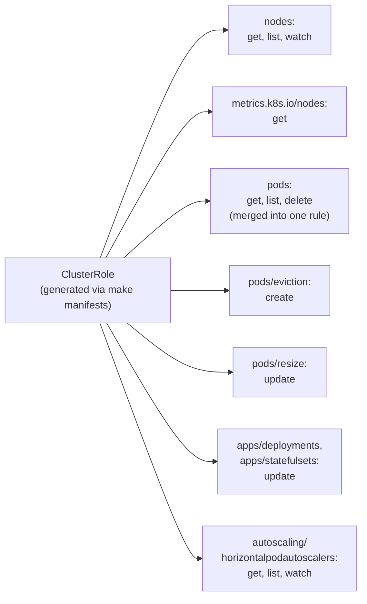
```mermaid
flowchart LR
    Role["ClusterRole<br/>(generated via make manifests)"] --> Nodes["nodes:<br/>get, list, watch"]
    Role --> Metrics["metrics.k8s.io/nodes:<br/>get"]
    Role --> Pods["pods:<br/>get, list, delete<br/>(merged into one rule)"]
    Role --> PodsEvict["pods/eviction:<br/>create"]
    Role --> PodsResize["pods/resize:<br/>update"]
    Role --> Workloads["apps/deployments,<br/>apps/statefulsets:<br/>update"]
    Role --> HPA["autoscaling/<br/>horizontalpodautoscalers:<br/>get, list, watch"]
```

Permissions added specifically for this package (`+kubebuilder:rbac` markers live in
[`reconciler.go`](reconciler.go), [`retry_enactor.go`](retry_enactor.go),
[`move_enactor.go`](move_enactor.go), [`scale_enactor.go`](scale_enactor.go), and
[`resource_enactor.go`](resource_enactor.go)):

```
+kubebuilder:rbac:groups="",resources=nodes,verbs=get;list;watch
+kubebuilder:rbac:groups=metrics.k8s.io,resources=nodes,verbs=get
+kubebuilder:rbac:groups="",resources=pods,verbs=delete
+kubebuilder:rbac:groups="",resources=pods/eviction,verbs=create
+kubebuilder:rbac:groups="apps",resources=deployments;statefulsets,verbs=update
+kubebuilder:rbac:groups="autoscaling",resources=horizontalpodautoscalers,verbs=get;list;watch
+kubebuilder:rbac:groups="",resources=pods,verbs=get;list
+kubebuilder:rbac:groups="",resources=pods/resize,verbs=update
```

The two `pods` markers (`delete` here, `get;list` from `resource_enactor.go`) merge into the same
rule as the `get;list;watch` already granted by the `OrchestrationProfile` controller's own
markers — `make manifests` produces one combined `pods` rule, not three duplicates.

Regenerate `config/rbac/role.yaml` with `make manifests` after changing these markers.

### CRD schema

```mermaid
flowchart TD
    RS["RebalancingStatus"] --> Active["Active fields:<br/>state, reason, decisionId,<br/>action, details, startedAt,<br/>lastTransitionAt, cooldownUntil"]
    RS --> RD["recentDecisions[]"]
    RD --> RDF["RebalanceDecision:<br/>outcome, action, reason,<br/>decisionId, details,<br/>startedAt, lastTransitionAt"]
```

`RebalancingStatus` (in `api/v1alpha1/orchestrationprofile_types.go`) carries: `state`
(OpenAPI-enum-validated against the 5 active states), `reason`, `decisionId`, `action`,
`details`, `startedAt`, `lastTransitionAt`, `cooldownUntil`, and `recentDecisions` (rolling
history, each entry shaped like `RebalanceDecision` — `outcome` is its own OpenAPI enum,
separate from and never overlapping with `state`'s).

An operator upgrading from the older 9-value `state` enum needs
`cmd/migrate-rebalance-status` run once against the cluster first — see that command's own
doc comment for the exact order (apply the new CRD, then run the migration, then roll out the
new operator build).

### Deployment

```mermaid
flowchart LR
    P2["Phase 2<br/>install_metrics_server.sh"] --> P4["Phase 4<br/>deploy_operator.sh"]
    P4 --> Ready["operator pod Ready"]
    Ready --> RE2["Rebalance Engine<br/>starts automatically"]
```

- `hack/install_metrics_server.sh` — idempotent metrics-server installer, wired into
  `hack/deploy_full_stack.sh` Phase 2 (default on, `INSTALL_METRICS_SERVER=false` to skip).
  Without it, `CPUThreshold`/`MemoryThreshold` simply never fire; nothing else is affected.
- `hack/deploy_operator.sh` / `hack/deploy_full_stack.sh` print a component breakdown at
  deploy time so it's clear the rebalance engine isn't a separate opt-in piece — it starts
  the moment the operator pod is `Ready`.

<a id="demo-walkthrough"></a>
## 🎬 <u>Demo walkthrough</u>

[`hack/demo_rebalance.sh`](../../hack/demo_rebalance.sh) drives all six lifecycle paths
above against a live cluster, narrated pane-by-pane (see the script's own header comment for
pane setup and usage: `hack/demo_rebalance.sh [noop|retry|move|scale|resources|escalate|cleanup]`).

### Feature view — what each beat proves

These show the capability being demonstrated — the before/after a viewer actually cares
about — with no script or state-machine internals. The mechanics behind each one are in the
next section.

**Beat 1 — NoOp: it watches, but doesn't overreact**

```mermaid
flowchart LR
    Pod["Running pod,<br/>well placed"] --> Watch["Engine evaluates<br/>continuously"]
    Watch --> Decision{"Anything<br/>need to change?"}
    Decision -- "No" --> Stable["Stays exactly<br/>where it is"]
```

**Beat 2 — Retry: self-heals around external constraints**

```mermaid
flowchart LR
    subgraph Before["Before"]
        P1["Pod: Pending<br/>blocked by an<br/>energy constraint"]
    end
    subgraph After["After the constraint clears"]
        P2["Pod: Running<br/>auto-recovered,<br/>no one intervened"]
    end
    Before -->|"engine notices the<br/>instant it's unblocked"| After
```

**Beat 3 — Move: actively rebalances, safely and precisely**

```mermaid
flowchart LR
    subgraph Before["Before"]
        N1["Node A — busy<br/>🟥 Pod X"]
        N2["Node B — idle"]
    end
    subgraph After["After the AI-driven Move"]
        N1b["Node A"]
        N2b["Node B<br/>🟩 Pod X"]
    end
    Before -->|"AI recommends relocating<br/>Pod X to Node B"| After
```

**Beat 4 — Scale: adjusts capacity directly, up or down**

```mermaid
flowchart LR
    subgraph Before["Before"]
        D1["Deployment: 1 replica"]
    end
    subgraph After["After the AI-driven AdjustReplicas"]
        D2["Deployment: 2 replicas<br/>(or fewer, if demand dropped)"]
    end
    Before -->|"AI recommends a new<br/>target replica count"| After
```

**Beat 5 — Resources: right-sizes a container without disrupting it**

```mermaid
flowchart LR
    subgraph Before["Before"]
        C1["Container: cpu=100m<br/>memory=128Mi"]
    end
    subgraph After["After the AI-driven AdjustResources"]
        C2["Same pod, same identity<br/>cpu=150m memory=192Mi<br/>(in place, where supported)"]
    end
    Before -->|"AI recommends a new<br/>target CPU/Memory"| After
```

**Beat 6 — Escalate: knows when to stop and ask for a human**

```mermaid
flowchart LR
    subgraph Before["Before"]
        R1["Repeated Failed cycles,<br/>or the AI itself says<br/>'I need a human'"]
    end
    subgraph After["After"]
        R2["Loop pauses itself —<br/>no more automated action<br/>until someone clears it"]
    end
    Before -->|"escalate"| After
```

HIRO doesn't just place workloads intelligently once — it keeps watching, and can safely
move things, resize capacity, or right-size resource usage later if conditions change. And
when it genuinely can't make progress on its own, it says so and stops, instead of retrying
forever or guessing.

### Mechanics — what the script actually does

The diagrams above show the capability; these show the state-machine path and the
`hack/demo_rebalance.sh` mechanics that get there for each beat.

**Beat 1 — NoOp**

```mermaid
flowchart TD
    Start(["noop()"]) --> Clear["clear_cooldown"]
    Clear --> Wait["wait up to 30s<br/>(periodic tick)"]
    Wait --> Cycle["Watching → Triggered →<br/>Evaluating → Watching<br/>(outcome: NoOp)"]
    Cycle --> More{"round < 3?"}
    More -- yes --> Clear
    More -- no --> Done(["done"])
```

**Beat 2 — Retry (`RetryPendingSchedule`)**

```mermaid
flowchart TD
    Start(["retry()"]) --> Clear["clear_cooldown"]
    Clear --> Scale["scale nginx-deployment-2<br/>+1 replica"]
    Scale --> WaitPending["wait up to 60s for<br/>new pod → Pending"]
    WaitPending --> Reassert["reassert clear_cooldown +<br/>open_energy_window<br/>every 3s (up to 90s)"]
    Reassert --> Trigger["EnergyThreshold case 3 matches<br/>(window open + pod Pending)"]
    Trigger --> Cycle["Triggered → Evaluating (bypass,<br/>no AI) → Decided → Enacting →<br/>Watching (outcome: Enacted)"]
    Cycle --> Gone["pending pod deleted,<br/>replacement schedules clean"]
```

**Beat 3 — Move**

```mermaid
flowchart TD
    Start(["move()"]) --> Bump["bump_mock_agent<br/>(force guaranteed Move)"]
    Bump --> CloseLoop["reassert clear_cooldown +<br/>close_energy_window<br/>every 2s (up to 150s)"]
    CloseLoop --> Trigger["EnergyThreshold matches<br/>(window closed)"]
    Trigger --> Cycle1["Triggered → Evaluating (AI call,<br/>Move accepted) → Decided →<br/>rate-limit gate → Enacting"]
    Cycle1 --> Open["open_energy_window<br/>(replacement needs it open)"]
    Open --> KeepOpen["keep_window_open enacting:<br/>reassert every 3s for<br/>60s window"]
    KeepOpen --> Store["DecisionStore hit —<br/>replacement scored onto<br/>TargetNode, no 2nd AI call"]
    Store --> Revert["revert_mock_agent"]
    Revert --> Cycle2["Watching (outcome: Enacted)"]
```

**Beat 4 — Scale**

```mermaid
flowchart TD
    Start(["scale()"]) --> Capture["capture_original_replicas<br/>(idempotent)"]
    Capture --> Bump["bump_mock_agent_scale<br/>(force guaranteed AdjustReplicas)"]
    Bump --> CloseLoop["reassert clear_cooldown +<br/>close_energy_window<br/>every 2s (up to 150s)"]
    CloseLoop --> Trigger["EnergyThreshold matches<br/>(window closed)"]
    Trigger --> Cycle1["Triggered → Evaluating (AI call,<br/>AdjustReplicas accepted) → Decided<br/>→ Enacting"]
    Cycle1 --> Open["open_energy_window<br/>(new replica needs it open)"]
    Open --> KeepOpen["keep_window_open enacting:<br/>reassert every 3s for<br/>60s window"]
    KeepOpen --> Patch["Spec.Replicas patched,<br/>ReadyReplicas polled"]
    Patch --> Revert["revert_mock_agent_scale"]
    Revert --> Cycle2["Watching (outcome: Enacted)"]
```

**Beat 5 — Resources**

```mermaid
flowchart TD
    Start(["resources()"]) --> Capture["capture_original_resources<br/>(idempotent)"]
    Capture --> Bump["bump_mock_agent_resources<br/>(force guaranteed AdjustResources)"]
    Bump --> CloseLoop["wait_for_resources_applied:<br/>reassert clear_cooldown +<br/>close_energy_window every 2s,<br/>polling requests.cpu (up to 150s)"]
    CloseLoop --> Trigger["EnergyThreshold matches<br/>(window closed)"]
    Trigger --> Cycle1["Triggered → Evaluating (AI call,<br/>AdjustResources accepted) → Decided<br/>→ Enacting → Watching, all in<br/>one reconcile (template patched)"]
    Cycle1 --> Open["open_energy_window<br/>(only matters if the fallback<br/>rollout path is taken)"]
    Open --> KeepOpen["keep_window_open rollout:<br/>reassert every 3s until $APP's<br/>rollout finishes (up to 90s)"]
    KeepOpen --> Resize["template patched, then<br/>in-place resize attempted<br/>on running pod(s)"]
    Resize --> Revert["revert_mock_agent_resources"]
    Revert --> Cycle2["Watching (outcome: Enacted)"]
```

**Beat 6 — Escalate**

```mermaid
flowchart TD
    Start(["escalate()"]) --> A1["Part A: bump_mock_agent_escalate<br/>(force guaranteed Escalate)"]
    A1 --> A2["wait_for_escalated:<br/>reassert clear_cooldown +<br/>close_energy_window<br/>every 2s (up to 90s)"]
    A2 --> A3["one cycle: Triggered → Evaluating<br/>(AI call, Escalate) → Watching<br/>(outcome: Escalated, escalated=true)"]
    A3 --> A4["clear_escalation<br/>(the documented unpause)"]
    A4 --> B1["Part B: lower escalationThreshold<br/>to 2, scale mock agent to 0"]
    B1 --> B2["wait_for_escalated again:<br/>~2 quick Failed cycles<br/>(AI unreachable, ~5s each)"]
    B2 --> B3["2nd Failed cycle promoted:<br/>Watching (outcome: Escalated),<br/>escalated=true — no dispatcher<br/>involved, all inside Transition"]
    B3 --> B4["restore mock agent,<br/>clear_escalation,<br/>revert escalationThreshold"]
    B4 --> Done(["one more normal cycle<br/>proves detection resumed"])
```

Neither escalation path touches scheduling once a cycle starts, but `wait_for_escalated` still
closes the energy window on every reassert: `$PROFILE`'s only configured trigger condition is
`EnergyThreshold`, which only matches while the window is closed — same dependency beats 3/4
have, for an unrelated reason (theirs is about the *replacement* pod scheduling; this one is
about the *trigger* matching at all). Part B's `escalationThreshold` is lowered purely so the
demo doesn't take as long: the promotion logic itself lives entirely
inside `StateWriter.Transition` (see [Escalation — pausing on repeated
failures](#escalation--pausing-on-repeated-failures)), the same for both paths and for any
value of the threshold. Simulating "the AI is unreachable" (scaling `mock-decision-agent` to 0)
rather than forcing real Move/Scale timeouts is what keeps Part B's Failed streak fast —
bounded by `DecisionTimeout` (~5s) instead of a 60s enactor timeout.

Beat 5 can't poll for Enacting the way beats 3/4 do: resourceEnactor's fallback (template-
patch) path patches and returns to Watching in the same reconcile, so Enacting never lingers
long enough for a 2s poll to observe it. `wait_for_resources_applied` polls the Deployment's
actual `requests.cpu` instead, and `keep_window_open rollout` polls `kubectl rollout status`
instead of profile state — both race-free against how fast this particular enactor completes.

Beats 2, 3, 4, and 5 all re-assert their patches on a loop instead of applying them once: a
one-shot patch can lose a race against cooldown re-arming or against
`eaoprofile-optional`'s own external controller reconciling a change back. The script
captures that EAO's real pre-demo window state the first time it patches it and restores it
on exit — see `capture_eao_original`/`revert_eao_window` in the script — rather than waiting
out that external controller's own reconcile cadence. Beats 2 and 4 similarly capture
$APP's real pre-demo replica count exactly once (`capture_original_replicas`), and beat 5
captures its real pre-demo container resources the same way (`capture_original_resources`),
so cleanup restores them correctly regardless of which beat runs, or in what order. Because
EAO's true pre-demo status can itself be a closed window, `revert_replicas`/`revert_resources`
each open the window and wait out $APP's rollout before returning, so `cleanup()` only hands
window control back to EAO's real status once nothing is still trying to schedule.

Beat 6 re-asserts the same way, and for the same underlying reason — its trigger condition
(`EnergyThreshold`) needs the window closed to match, same as beats 3/4, even though nothing
it enacts needs scheduling. It captures `escalationThreshold`'s real pre-demo value the same
idempotent way
(`capture_original_escalation_threshold`), and `cleanup()` also unconditionally checks the
*live* `escalated` flag (`ensure_not_escalated`), not a beat-scoped variable — escalation is
reachable from any beat's own repeated failures, not just beat 6, so this is the one cleanup
step that isn't gated on "did beat 6 specifically run."

<a id="testing"></a>
## 🧪 <u>Testing</u>

```mermaid
flowchart TB
    Unit["Unit tests (this package)<br/>fake client + fake metrics-server"] --> Fast["Fast — no CRD schema checks"]
    Envtest["envtest<br/>internal/controller/op_rebalancing_status_test.go"] --> Real["Real API server —<br/>proves OpenAPI enum validation"]
```

No envtest suite in this package — everything is tested against `sigs.k8s.io/controller-
runtime/pkg/client/fake` (plus `k8s.io/metrics/.../fake` for metrics-server), which is fast
and sufficient for what's here: no CRD-schema-level behavior is being exercised (that's
covered separately by `internal/controller/op_rebalancing_status_test.go`, which does use
envtest to prove the OpenAPI enum validation actually works against a real API server).

Two non-obvious things worth knowing if you're adding tests here:

- `metricsfake.NewSimpleClientset(objects...)` silently drops seeded `NodeMetrics` objects —
  it infers the REST resource name via naive Kind pluralization ("nodemetrics"), but the
  real resource name is the irregular "nodes". Seed via `Tracker().Create()` with the
  explicit GVR instead (see `pressure_test.go`'s `newTestPressureEvaluator`).
- `record.NewFakeRecorder(n)` blocks (not drops) once its channel fills — a test that emits
  many transitions without draining events will hang, not fail loudly. Size the buffer
  generously in any test that loops over multiple transitions.
